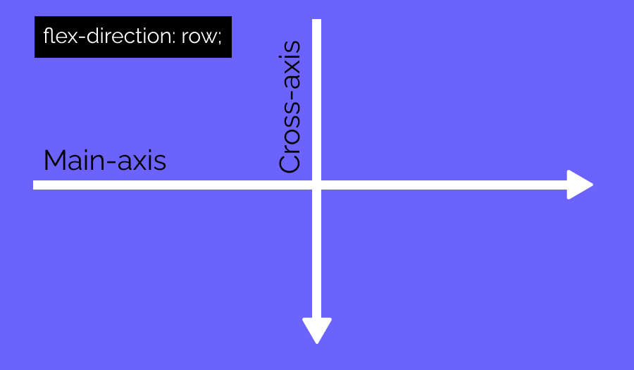
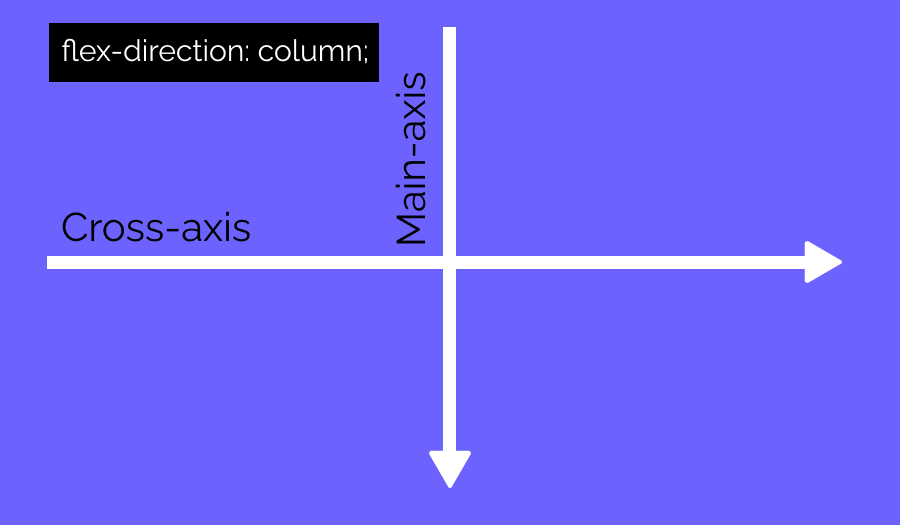
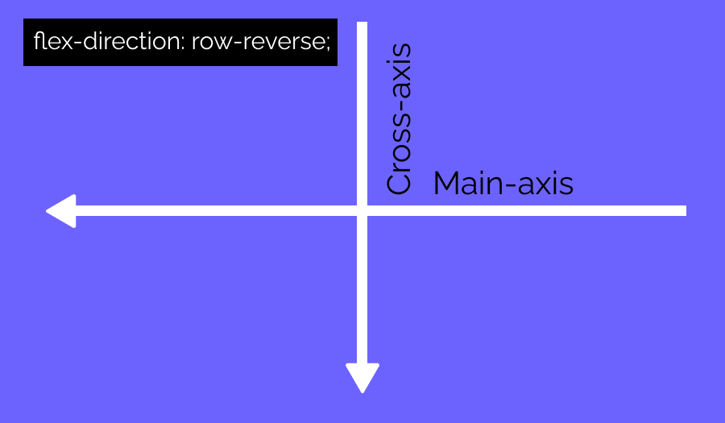

# Flex container

Definimos el contenedor en display:flex.

El justify-content es para alinear los elementos horizontalmente.
Esto es asi porque el Main-axis es de izquierda a derecha, es decir el eje principal es de izquierda a derecha. 

Esto es porque el flex-direction esta en row , que es por defecto.
Pero si cambiamos el flex-direction a column o row-reverse cambiamios el Main-axis

Ahora si queremos alinear los elementos verticalmente, es decir en el eje secundario Cross-axis, podemos usar la propiedad align-items.

Todo esto siempre y cuando no cambiemos el flex-direction que se encuentra por defecto en row.

Cuando tenemos mas de una fila o columna podemos usar el align-content. Tambien actua sobre el Cross-axis.

Siempre que tengamos configurado en flex-wrap:wrap.
Por defecto esta en nowrap o sea que desborda por defecto.
Si lo ponemos en wrap tenemos mas filas o columnas que nos permiten usar el align-content

---
 
 # Flex items (Los elementos hijos del flex container)

Podemos usar la propiedad order: 
Por defecto esta en 0.
Pero podemos colocar a cada elemento distinto order:1; order:-1; cualquier numero, y se terminan ordenando de mayor a menor

## flex-grow

Cuando hay espacio blanco sobrante.
Cuando usamos flex, por ejemplo el contenedor tiene 400px y definimos 3 hijos flex items en 100px cada uno, sobran 100px que quedan en blanco.
Entonces la propiedad flex-grow nos ayuda a decir la proporcion que tendra cada hijo flex item con respecto a otro hijo flex item. Es la proporcion de crecimiento de los flex items.
Por defecto flex-grow:0; es decir ninguno se lleva el espacio en blanco.
Pero si en cada elemento colocamos un flex-grow:1 se reparten esos 100px entre los 3. Quedando cada elemento en 133.33px.

En el caso de definir 2 hijos con flex-grow:1, y el otro flex item en flex-grow:2; Mirando en fracciones tenemos 1+1+2=4. Entonces el que esta en 2 se lleva 2/4 

# flex-shrink

Es el caso contrario, cuando hay espacio faltante y los flex items se achican. 
flex-shrink reparte el espacio faltante.
Por ejemplo tenemos un contenedor en 400px y definimos 3 hijos flex items en 200px cada uno. Faltan 200px que se tienen que conseguir achicando los 3.
Por defecto flex-shrink:1 en los 3; es decir se achican proporcionalmente. 1+1+1=3
200px / 3 = 66.6px . Que se va a achicar cada uno. Quedando cada uno en 200px-66.6= 133.33px.

Si definimos uno solo de los elementos en flex-shrink:2 los 200 se van a repartir entre 4. 1+1+2=4
200px / 4= 50px. Donde el que estaba en 2 se le restan 2/4. 200px = 100px
y a los otros se les restan 1/4. 200px - 50px = 150px

---

# flex-basis

Indica el tamaño inicial del elemento antes que se aplique el flex-grow o el flex-shrink. Por defecto flex-basis:auto o 1.

Lo que hace es definir el tamaño del elemento dependiendo del Main-axis. 
Por ejemplo si al elemento flex-item le damos un flex-basis:50px. Aunque hayamos definido un widht:100px pesa mas el 50.
Es decir resulta util si cambiamos el Main-axis con flex-direction:column  .

Con flex-shrink:0 le quitamos la propiedad a los elementos flex de adaptarse al contenedor

---

**align-self permite alinear a los flex items en el Cross-axis independientemente del resto , sin respetar a los hermanos.**
