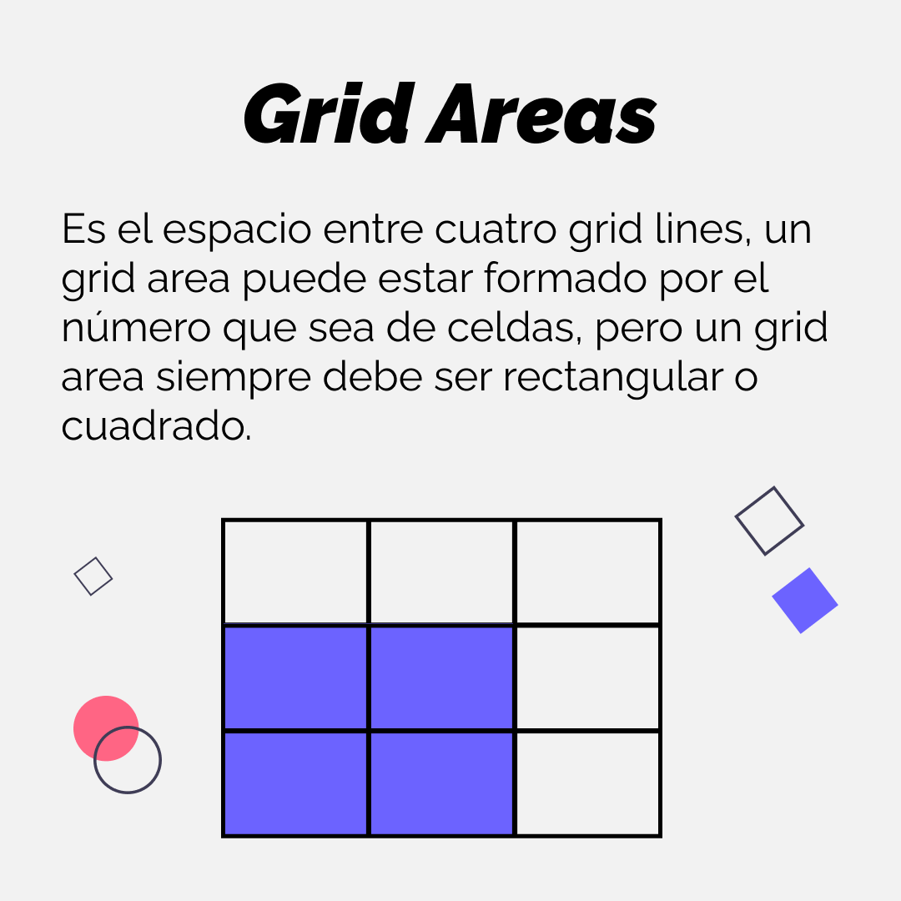

# Grid
Sistema de cuadriculas bidimensional.

## Filas (Horizontales) y Columnas (Verticales)
Cada fila y cada columna esta formada por 2 lineas.
Todas las filas y columnas juntas forman una cuadricula.

## Celdas
La unidad mas pequeña de la cuadricula.

Cada grid-item ocupa una celda por defecto.

## Lineas
Cada fila tiene 2 lineas. Cada columna tiene 2 lineas.

## Grid Areas
Espacio entre 4 lineas, puede ser una celda o varias. 

---

# Forma de utilizar Grid
Se crea un contenedor y dentro display:grid.

.contenedor {
    display:grid;
}

La forma mas facil es hacer un template con grid-template-colums y grid-template-rows.
**En cada uno se coloca una unidad de medida o varias, eso define la cantidad de filas o columnas que queremos**

.contenedor {
    display:grid;
    grid-template-colums:10px 40% 20px; /*Aca creamos 3 columnas, con sus anchos respectivos*/
    grid-template-rows:20% 10px; /*Aca creamos 2 filas con sus altos respectivos*/
}

Y dependiendo de la cantidad de elementos que pusimos en el HTML se van colocanto en las celdas.
Si sobran elementos del HTML las filas se crean con la propiedad 
grid-auto-rows:auto. Podemos cambiar ese auto por px % pero mejor hacer bien el template.

Pero ahora si queremos 100 columnas iguales con 50 filas iguales eso seria tedioso.
Una forma de hacerlo es usando la funcion repeat(cantidad,tamaño)

.contenedor {
    display:grid;
    grid-template-colums:repeat(3,20px) /*Aca creamos 3 columnas, con 20px de ancho*/
    grid-template-rows:(2,50%) /*Aca creamos 2 filas con 50% de alto*/
}

Ahora si queremos ocupar todo el ancho o alto de la pantalla, sin usar pixeles px o porcentaje %, por ejemplo queremos 3 columnas de 33%, nos faltarian decimales. Lo podemos solucionar usando la propiedad fr es decir una fraccion.

grid-template-colums:repeat(3,1fr);

Y se reparten las 3 columnas equitativamente.

---

## Profundizamos en fr

Es una unidad de medida exclusiva de grid.
Sirve para dividir equitativamente si no sabemos las medidas.

Ej:

grid-template-colums:100px 1fr 1fr; 
Creamos la primer columna de 100px pero las 2 columnas restantes se llevan el resto del ancho de la pantalla 

Veamos otro ejemplo:

grid-template-colums:1fr 2fr 1fr;
Creamos 3 columnas y para ver como funciona sumamos las fracciones 1+1+2=4 
Entonces la primera columna se lleva 1/4 la segunda 2/4 y la tercera 1/4

---

## Gap
Son los espacios entre filas o columnas
Se utiliza la propiedad row-gap para filas y column-gap para las columnas.

Ej: 
row-gap: 10px;
column-gap: 2em;

Otra posibilidad es usar el shorthand gap.

Ej:
gap:20px; /*Todos los espacios de 20px*/
gap: 10px 20px; /*10px para las columnas, 20px para las filas*/ 

**CON LOS GAP NOS OLVIDAMOS DE COLOCAR LOS MARGIN**

---

# Alineacion por lineas

## Posicionando elementos en la cuadricula

Por ejemplo, si tenemos una cuadricula con 5 columnas, vamos a tener 6 lineas que las dividen. 
Si tenemos 4 filas vamos a tener 5 lineas que las delimitan.

Entonces, utilizando el inspector del navegador, podemos ver desde donde a donde van esas lineas, y de esa forma posicionar nuestros elementos grid-items.

En vez de darle un tamaño solo en el template asi 

.contenedor {
    display:grid;
    grid-template-colums:10px 40% 20px; /*Aca creamos 3 columnas, con sus anchos respectivos*/
    grid-template-rows:20% 10px; /*Aca creamos 2 filas con sus altos respectivos*/
}

Podemos personalizar nosotros el template definiendo el tamaño de los items luego.

Ej:

.contenedor {
    display:grid;
    gap:10px;
    grid-template-colums:repeat(5,1fr) /*Aca creamos 5 columnas del mismo tamaño*/
    grid-template-rows:repeat(5,1fr) /*Aca creamos 5 filas del mismo tamaño*/
}

Cada grid-item ocupa una celda, pero lo podemos cambiar.
En cada item hijo del container podemos usar las propiedades grid-column:comienzaLinea/finalizaLinea y grid-row:comienzaLinea/finalizaLinea para posicionar los elementos grid-items

.item1{
    grid-column: 1/3; /*Se posiciona desde la linea 1 a la linea 3 de las columnas*/
    grid-row: 1/4; /*Se posiciona desde la linea 1 a la linea 4 de las filas*/
}

Otro ejemplo:

.item{
    grid-column: 4/5; /*Se posiciona desde la linea 4 a la linea 5 de las columnas*/
    grid-row: 3/6; /*Se posiciona desde la linea 3 a la linea 6 de las filas*/
}

---

# Grid Areas

Otra forma de posicionar los elementos utilizando la propiedad grid-template-areas. Y recreamos una matriz dentro de esta propiedad. **Con nombres inventados pero con forma si o si rectangular cuando es el mismo nombre**
Se debe colocar la misma cantidad de filas y columnas que definimos en los template colums y rows.

Usando el mismo contenedor

.contenedor {
    display:grid;
    gap:10px;
    grid-template-colums:repeat(5,1fr) /*Aca creamos 5 columnas del mismo tamaño*/
    grid-template-rows:repeat(5,1fr) /*Aca creamos 5 filas del mismo tamaño*/

    grid-template-areas:
    "nav nav nav nav nav" 
    "main main main side side "
    "main main main side side "
    "main main main side side "
    "footer footer footer footer footer"
  

    /*Al ser 5 columnas podemos inventar 5 nombres para las celdas, y **se debe mirar lo que tiene un mismo nombre es un area**, compuesto por varias celdas con ese nombre*/
}
                                                

Luego en cada item le colocamos el nombre con la propiedad grid-area:.

.item1{
    grid-area:nav;
    backround-color: slateblue;
}
.item2{
    grid-area:main;
    backround-color:deeppink;
}
.item3{
    grid-area:footer;
    backround-color:tomatoe;
}
.item4{
    grid-area:side;
    backround-color:darkseagreen;
}
.item5{
    grid-area:
    backround-color:
}

 Y con un media queries podriamos cambiar los nombres de la matriz y cambiamos el formato. Pero si o si respetando los rectangulos

 Ej:

     grid-template-areas:
    "main main main side side "
    "main main main side side "
    "main main main side side "
    "nav nav nav nav nav" 
    "footer footer footer footer footer"

---

# Columnas dinámicas

En vez de usar la funcion asi repeat(5,1fr). Podemos usarla de esta manera:

repeat(auto-fit,minmax(250px,1fr));

Es decir definimos la cantidad que sea auto, y usando la funcion minmax(,) el primer parametro define el minimo en este caso 250px y el segundo el maximo que en este caso seria 1 fraccion 
