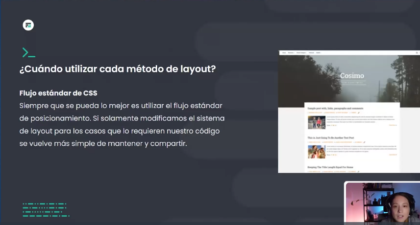
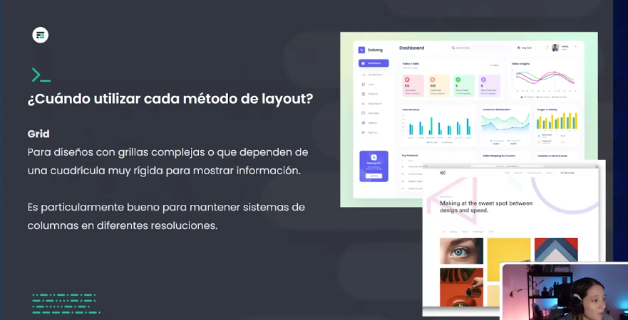
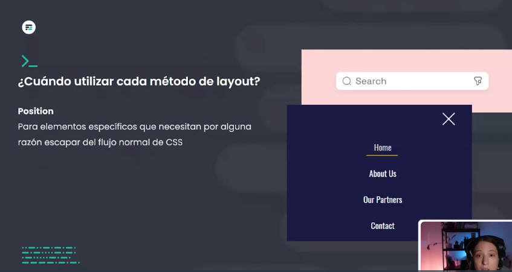

# ¿Cuándo utilizar cada método de layout? 

## Flujo estándar de CSS 

Siempre que se pueda lo mejor es utilizar el flujo estándar de posicionamiento. Si solamente modificamos el sistema de layout para los casos que lo requieren nuestro código se vuelve más simple de mantener y compartir. 

## Grid

Para diseños con grillas complejas o que dependen de una cuadrícula muy rígida para mostrar información. 
Es particularmente bueno para mantener sistemas de columnas en diferentes resoluciones. 

`Usar Grid cuando necesitemos varios elementos uno al lado del otro, pero con diferentes alturas`
 

## Flexbox 

Para la mayoría de las situaciones flexbox es la solución más simple y versátil, sobre todo en situaciones donde debemos manejar solamente una fila o una columna

## Position 

Para elementos específicos que necesitan por alguna razón escapar del flujo normal de CSS 

Ejemplos:
- Posicionar la lupa en una barra de busqueda
- Posicionar la X en una ventana modal o banner
- Tambien para colocar pseudoelementos decorativos

