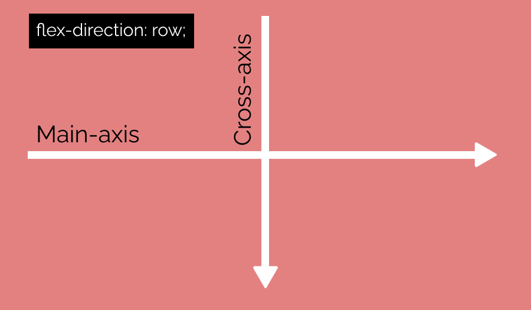
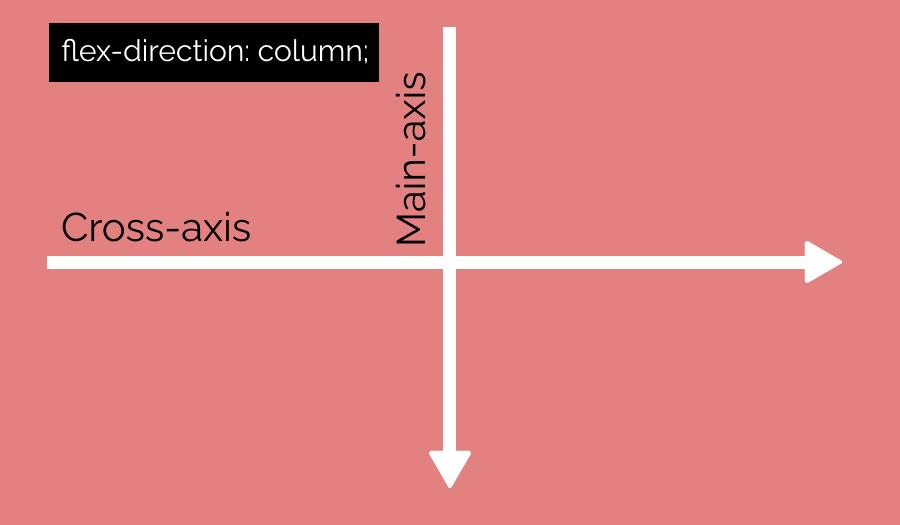
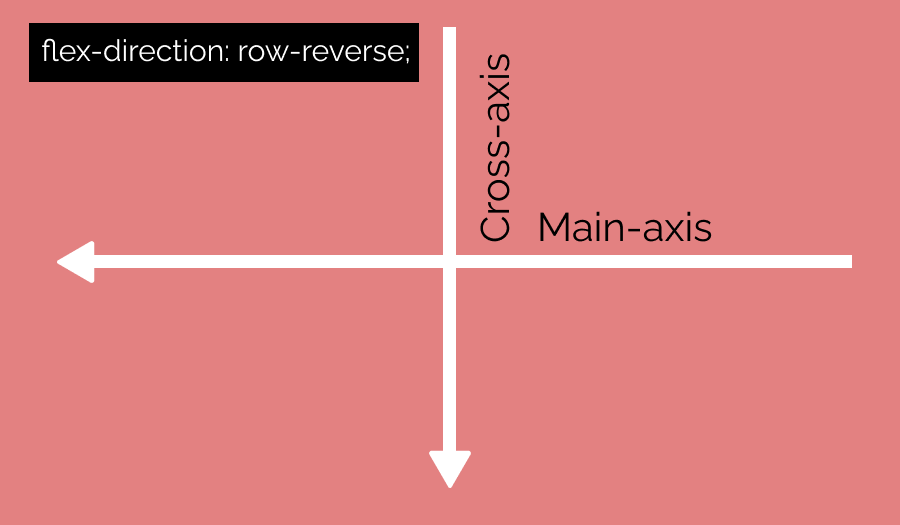
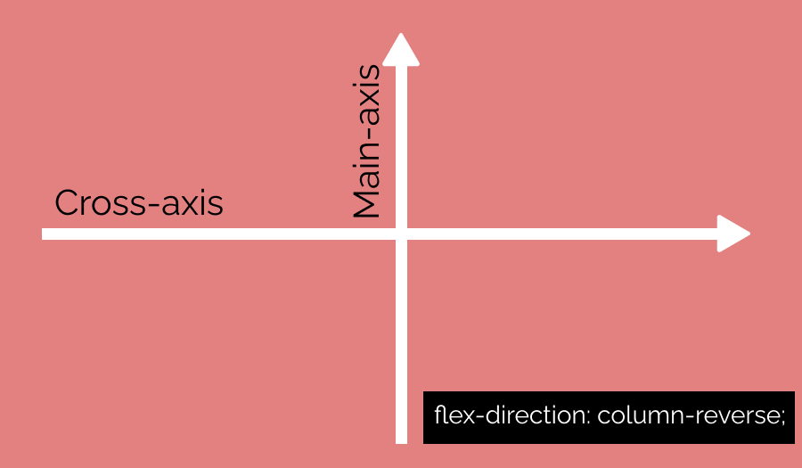

# Main-Axis 
Eje principal. 

# Cross-Axis
Eje secundario.
Siempre perpendicular al Main-Axis.

# flex-direction:row
Por defecto el Main-Axis esta definido en el eje horizontal (de izquierda a derecha), es decir por defecto la propiedad esta en **flex-direction:row**.
Y el Cross-Axis esta en el eje secundario por defecto. 

# flex-direction:column
Para definir el Main-Axis en vertical

# flex-direction:row-reverse
Para invertir Mai-Axis horizontal

# flex-direction:column-reverse
Para invertir Mai-Axis vertical
 

