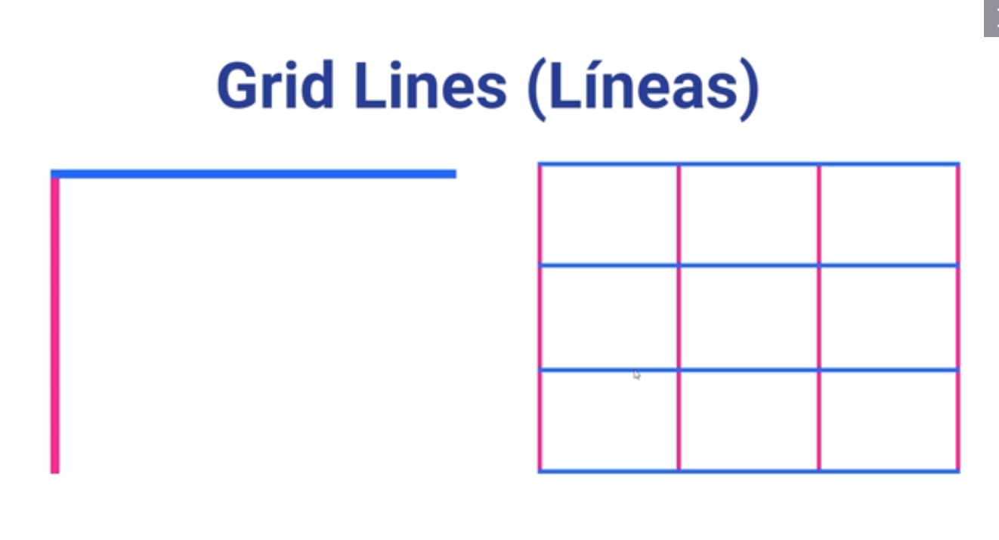
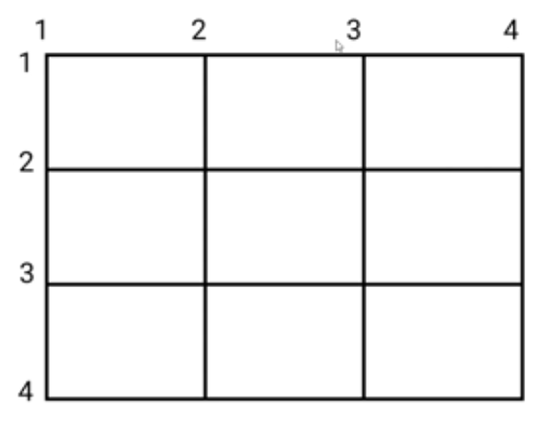
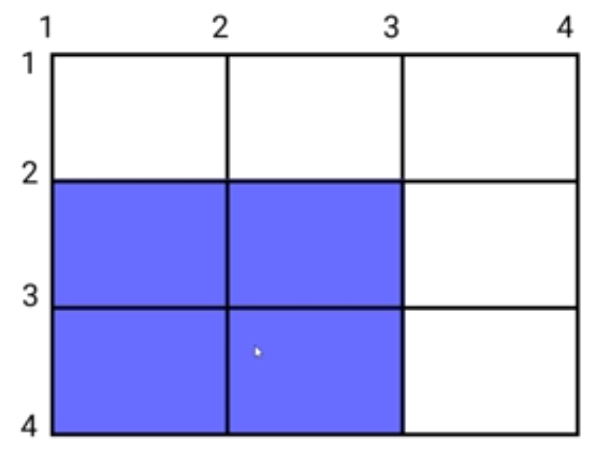
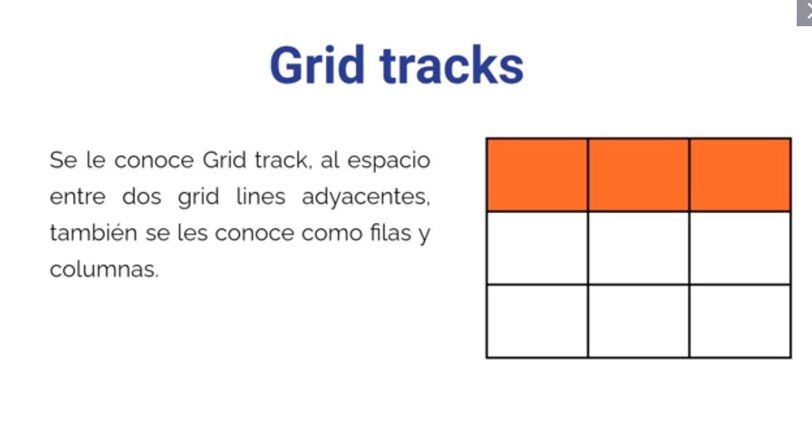
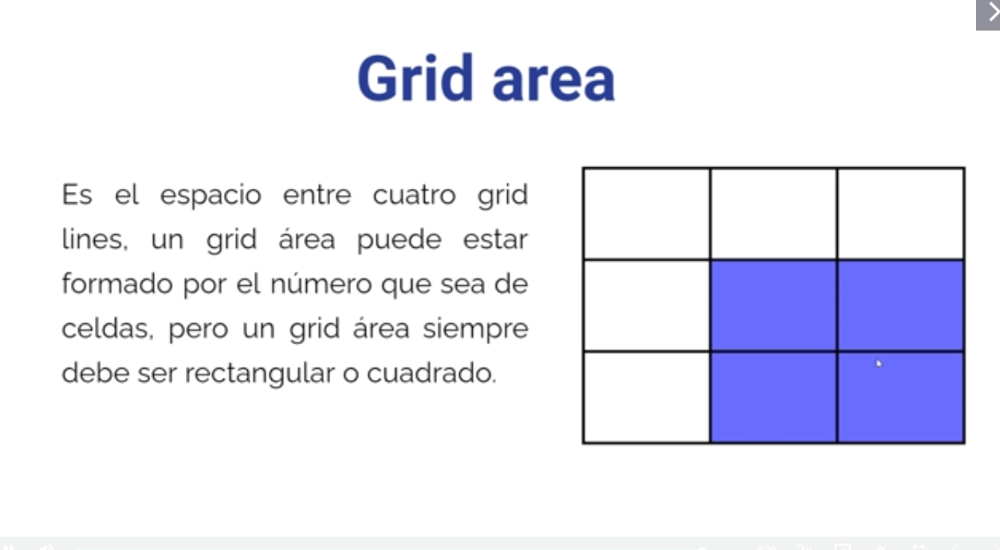

# ¿Qué es CSS GRID? 

CSS Grid Layout (Sistema de cuadrículas) es el sistema de diseño más poderoso disponible en CSS. Esto gracias a su sistema bidimensional, lo que significa que puede manejar tanto columnas como filas, a diferencia de flexbox, que es en gran medida un sistema unidimensional. 

## Grid container 

De la misma manera que en flexbox, para poder utilizar css grid, necesitamos un contenedor, a este contenedor se le denominará grid-container

## Grid Item

Teniendo creado un grid-container. es muy importantes saber, que los hijos directos del grid-container se les conoce como Grid-items. 

## Filas y Columnas 

Debido a que CSS Grid, trabaja con un sistema bidimensional, se usarán filas y columnas, las filas (rows) son horizontales. las columnas (columns) verticales. Un ejemplo es una hoja de cálculo en Excel. 

## Grid Cell (Celda) 

Las celdas o también llamadas Grid-cells son la parte más pequeña de la Grid. Por defecto cada grid-item se va a posicionar en una celda de la grid. (La suma de la celdas es la Grid)

## Grid Lines (Líneas) 

Las cuadrículas están compuestas por líneas. líneas (column-grid-lines) y horizontales (row-grid-lines). 

Las lineas azules en filas las lineas rosas en columnas.

 

La linea azul representa a la fila , la rosa representa la columna, la suma forma la grid.

Las lineas se enumeran

Podemos posicionar el elemento en base al numero de lineas

# Grid tracks 

Se le conoce Grid track, al espacio entre dos grid lines adyacentes, también se les conoce como filas y columnas.

# Grid area 

Es el espacio entre cuatro grid lines, un grid área puede estar formado por el número que sea de celdas, pero un grid área siempre debe ser rectangular o cuadrado.

Referencia: 

https://css-tricks.com/snippets/css/complete-guide-grid/

