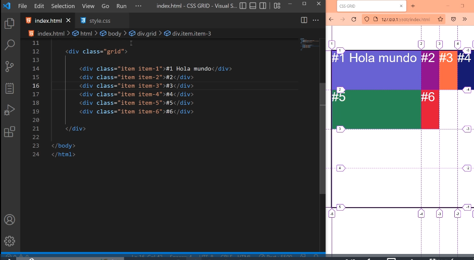
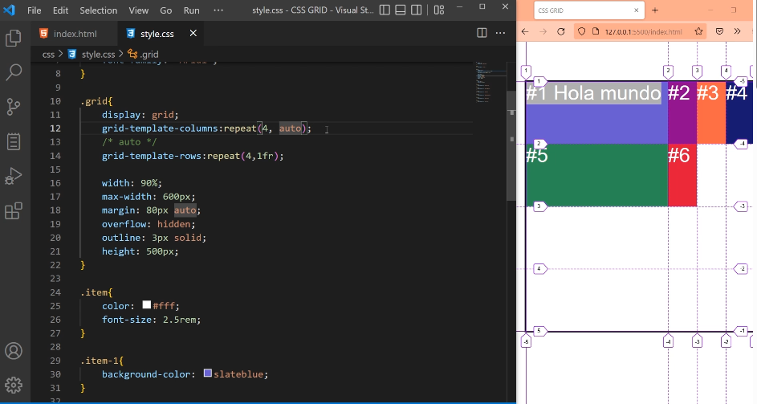
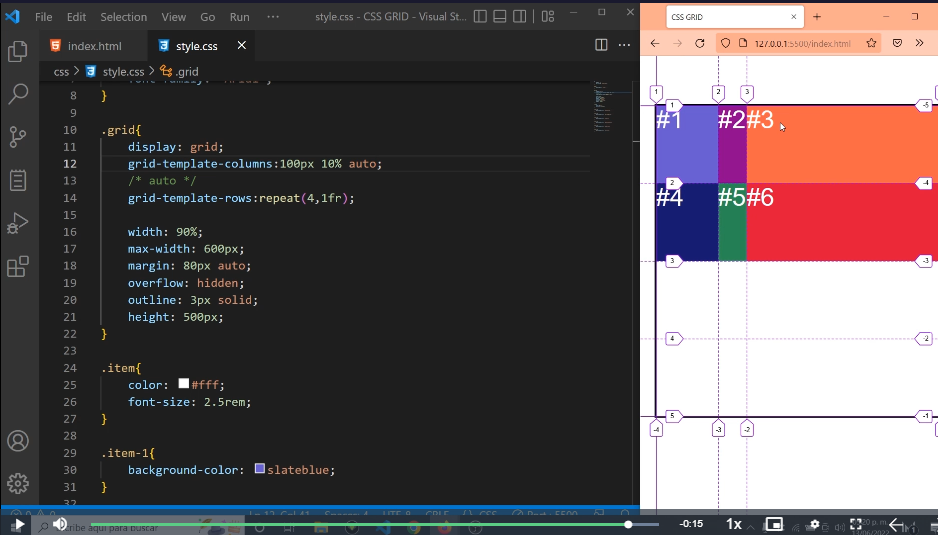

# Valor auto

`Se coloca en el contenedor padre, es decir donde colocamos grid-template-columns: o grid-template-rows:`

 El valor auto se comporta similar a fr. Con la diferencia que el contenedor se adapta al contenido del html.
 Por lo que en el tamaño minimo las columnas son iguales salvo si tienen contenidos distintos, es decir, se agrandan si el contenido de una es mas grande que otra o se achican si el contenido de una es mas chico que otra.

 Ej:
 grid-template-columns: repeat(4,auto);
 
 

 

## Otro ejemplo posible 

En este caso el auto se lo colocamos al objeto que queremos que sea diferente. En el anterior decide los tamaños automaticamente.

Ej:
grid-template-columns: auto repeat(3,auto);

*Son 4 columnas, la primera se lleva por el contenido*

## Otro ejemplo diferente

Cuando colocamos auto al final, si queda mas espacio disponible se lo lleva todo. Sin importar si no tiene contenido suficiente.

 Ej:
 grid-template-columns: 100px 10% auto ;
 
 

