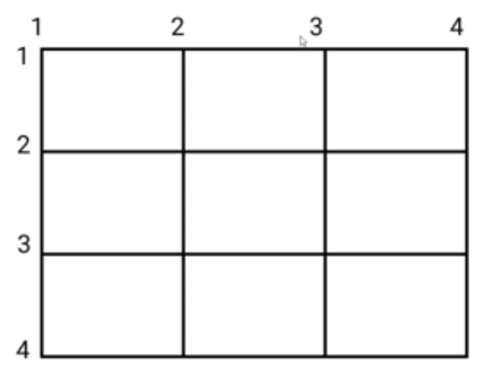
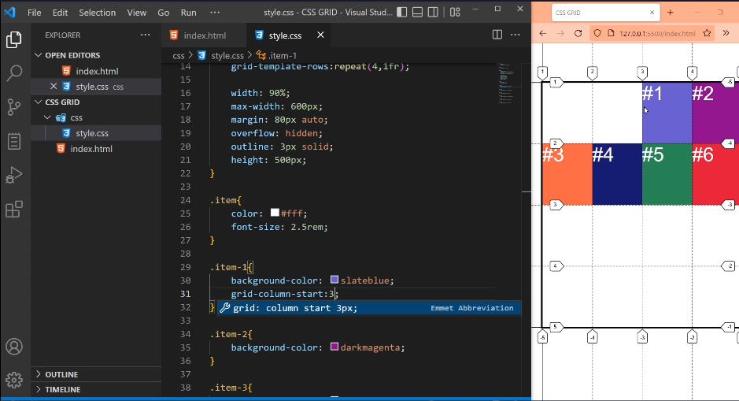
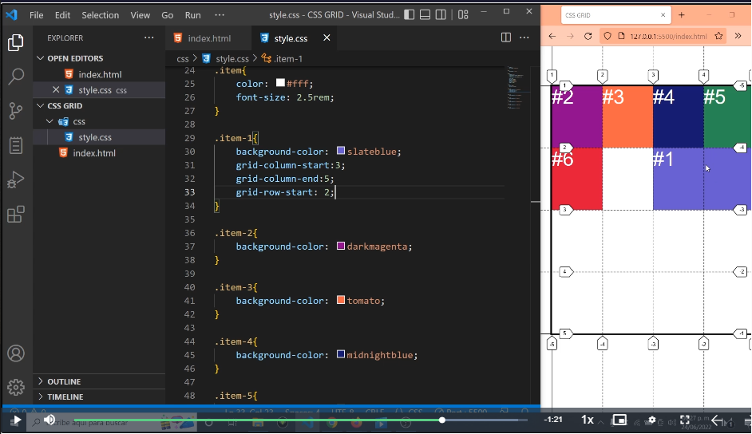

# Posicionando por Lineas CSS GRID

`Ahora colocamos propiedades en los elementos hijos, es decir los grid-items`.

Resumiento tenemos una linea de filas mas, que el total de filas. 
Y tenemos una linea de columnas mas, que el total de columnas.

## grid-column-start:

`Propiedad en los elementos hijos, es decir los grid-items`

Con esta propiedad indicamos en que linea de columna nos posicionamos con este elemento hijo.

Ej:
Inicia en la linea anterior a la columna 3.
grid-column-start:3;

## grid-column-end:

`Propiedad en los elementos hijos, es decir los grid-items`

Con esta propiedad indicamos en que linea de columnas termina este elemento hijo grid-item.

Ej:
Este elemento ocupa 2 columnas.

grid-column-start:3;
grid-column-end:5;

## grid-row-start:

`Propiedad en los elementos hijos, es decir los grid-items`

Con esta propiedad indicamos en que linea de filas nos posicionamos con este elemento hijo.

Ej:

grid-column-start:3;
grid-column-end:5;
grid-row-start:2;

## grid-row-end:

`Propiedad en los elementos hijos, es decir los grid-items`

Con esta propiedad indicamos en que linea de filas termina este elemento hijo grid-item.

Ej:

grid-column-start:3;
grid-column-end:5;
grid-row-start:2;
grid-row-end:5;

