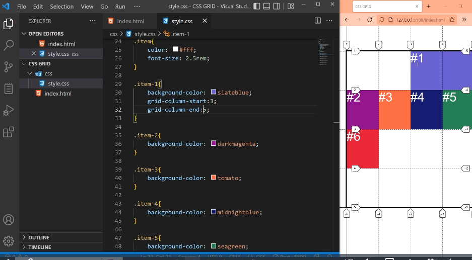
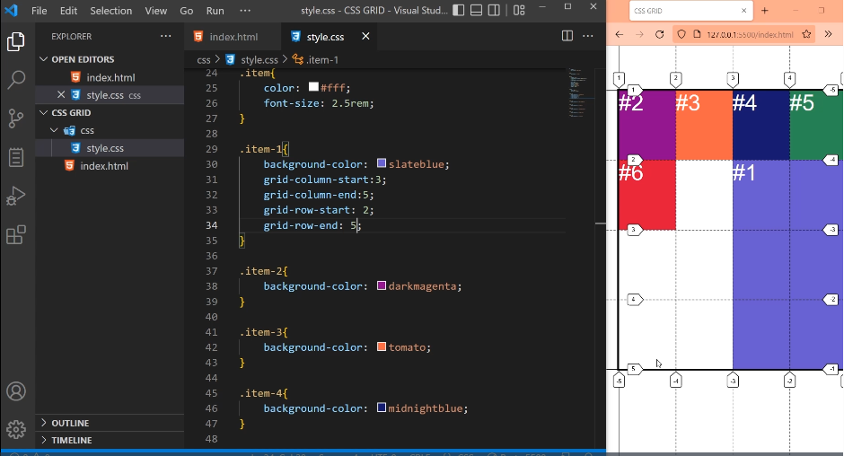
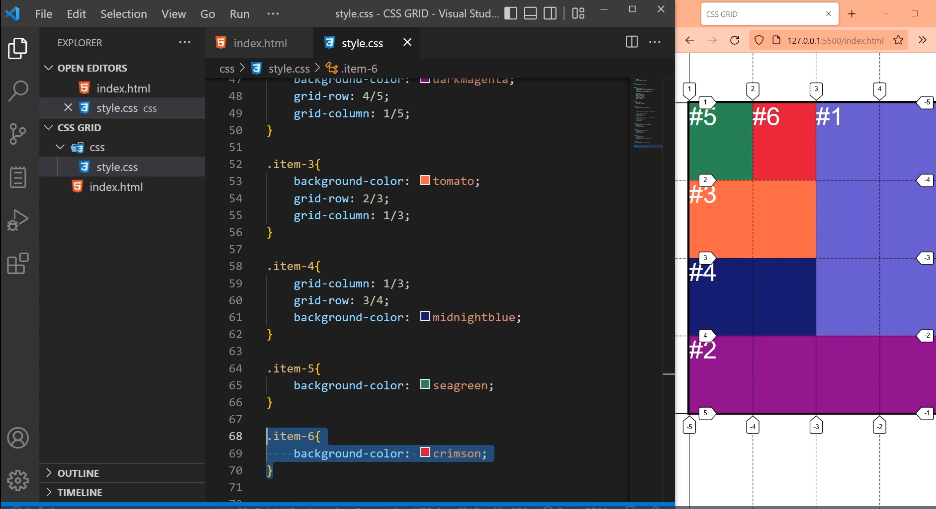

# Shorthand grid-column y grid-row

`Propiedad de los elementos hijos grid-items`.

## grid-column:

Propiedad shorthand para grid-column-start: y
grid-column-end: .

Acepta 2 valores separados por una diagonal:

grid-column: grid-column-start / grid-column-end

Ej:

grid-column: 3 / 5;

Seria lo mismo que:

grid-column-start:3;
grid-column-end:5;

## grid-row:

Propiedad shorthand para grid-row-start: y
grid-row-end: .

Acepta 2 valores separados por una diagonal:

grid-row: grid-row-start / grid-row-end

Ej:

grid-row: 2 / 5;

Seria lo mismo que:

grid-row-start:2;
grid-row-end:5;

## Ejemplo de un Layout completo 

.item-1{

    background-color: slateblue;
    grid-row:1/4;
    grid-column:3/5;

}

.item-2{

    background-color: darkmagenta;
    grid-column: 1/5; 
    grid-row: 4/5;
   
}

.item-3{
    background-color: tomato;
    grid-column: 1/3;
    grid-row:2/3;
}

.item-4{
    background-color: midnightblue;
    grid-column: 1/3;
    grid-row: 3/4; 
}

.item-5{
    
    background-color: seagreen;
}

.item-6{
    background-color: crimson;
}

**En los grid-items 5 y 6 no colocamos ninguna propiedad porque no hace falta, ya que por defecto ocupan una celda**