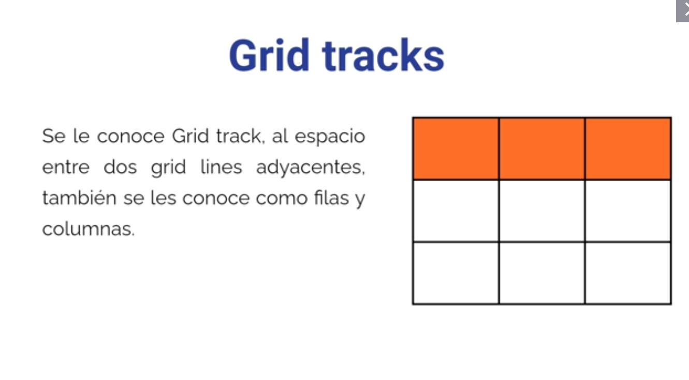
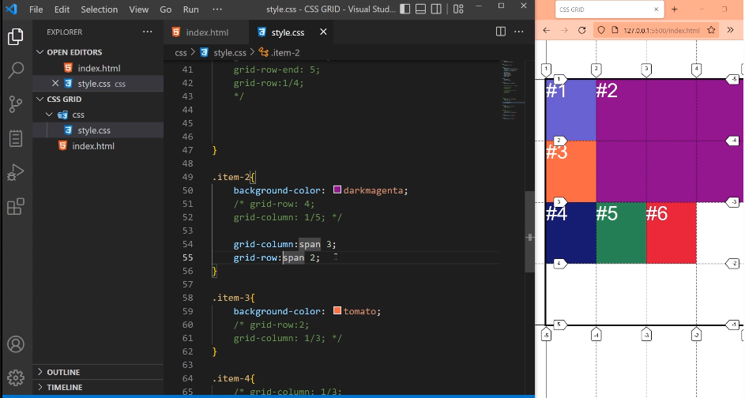
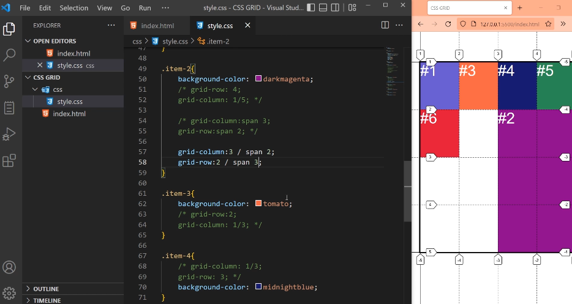
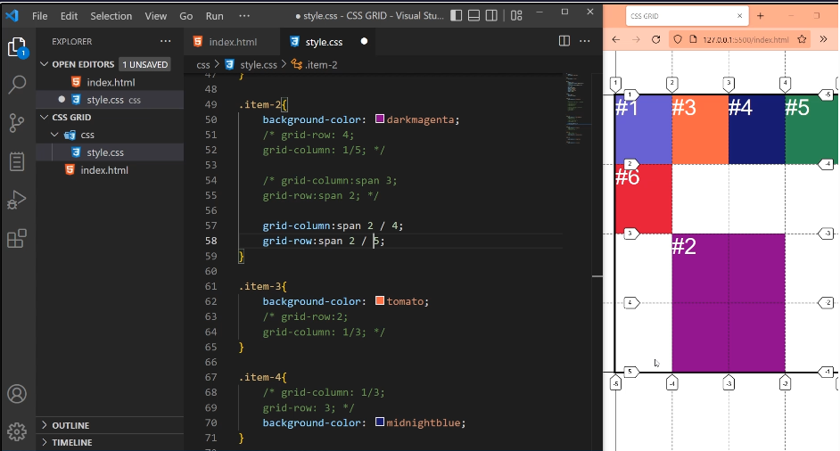

# span en CSS GRID

`Es una propiedad que sirve para decirle a los grid-items cuantos tracks queremos que ocupe`.

*Un track es el espacio que hay entre una linea y otra linea, puede ser una columna o una fila*

Nos ayudara cuando posicionemos elementos con lineas.
Esta creado para ser utilizado con las propiedades grid-column: y grid-row:.

`span numero = Cantidad de tracks`

Podemos cambiar la linea de comienzo o de final de los grid-column o grid-rows por span y una cantidad de tracks.

## Ejemplo desde la posicion inicial por defecto

grid-column:span 3; 
Significa que queremos que ocupe 3 tracks en columnas (Desde su posicion inicial).

grid-row:span 2; 
Queremos que ocupe 2 tracks en filas (Desde su posicion inicial).

## Si queremos que comience desde otra linea inicial.

Se coloca la linea de comienzo y luego la barra / con el span y la cantidad de tracks.

grid-column: 3 / span 2; 
Significa que queremos a partir de la linea de columnas 3, ocupe 3 tracks en columnas .

grid-row: 2 / span 3; 
Significa que queremos a partir de la linea de filas 2, ocupe 3 tracks en filas.

## Cambiando el span de lado

Podemos colocar el span antes o despues de la barra /

Lo que indica `span numero` es cuantos tracks queremos. Despues si no dice span indica la linea ya sea de comienzo o de fin

grid-column: span 2 / 4; 
Significa que queremos que ocupe 2 tracks en columnas y llegue a la linea de columnas 4.

grid-row: span 2 / 5; 
Significa que queremos que ocupe 2 tracks en filas y llegue a la linea de filas 5.

