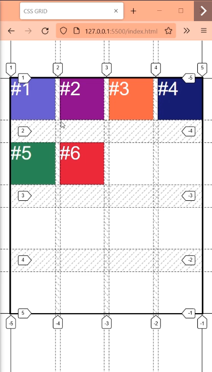

# grid-area

Shorthand para grid-column: y grid-row: que se aplica sobre los hijos grid-items.

Se define de la siguiente manera

`grid-area: row-start / column-start / row-end / column-end`

`grid-area: fila-inicio / columna-inicio / fila-final / columna-final`

Vamos a realizar el mismo ejemplo de la clase anterior pero con grid-area:

grid-column: 1 / -1;
Aca le decimos que llegue al final en columnas desde la primer linea de columnas.

grid-row: span 2 / -2;
Aca le estamos diciendo que ocupe 2 tracks en filas desde la penultima linea.

grid-area: span 2 / 1 / -2 / -1 ;

## Ejemplo si falta alguna linea

Por ejemplo si tenemos

grid-row: span 2;
Significa que queremos que tome automaticamente el origen y haga 2 tracks

grid-column: span 2 / -1;

Sesde la anteultima que haga 2 tracks para atras.

Ahora si queremos pasarlo a grid-area como le decimos que haga el grid-row ya que falta uno?

`grid-area: fila-inicio / columna-inicio / fila-final / columna-final`

grid-area span 2 /span 2 / auto /-1 ;

# Gutter o espaciadores gap

Es el espacio que se coloca entre filas y columnas. **No al principio ni al final**.

## row-gap:
Espacio entre filas

## column-gap:
Espacio entre columnas

## gap
Shorthand de row-gap: y column-gap:

`gap: row column`

### Ej:

row-gap:3em;
column-gap:10px;

Es lo mismo que

gap:3em 10px;

