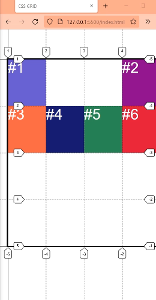
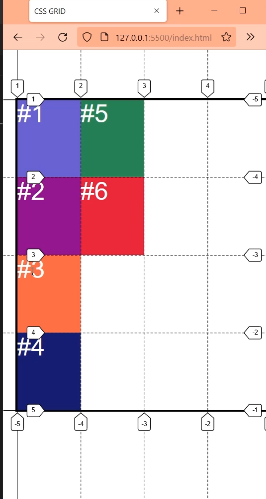
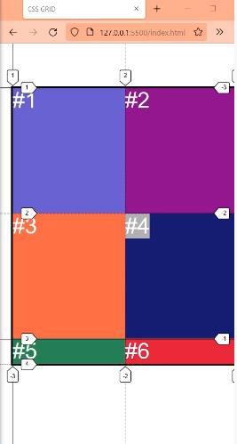
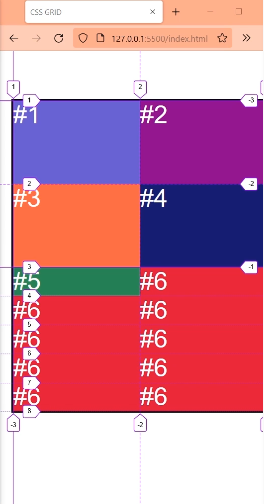
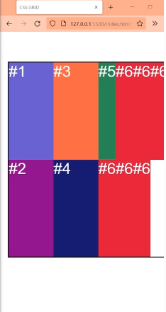
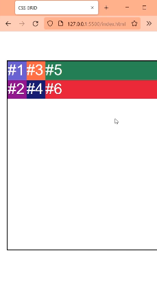
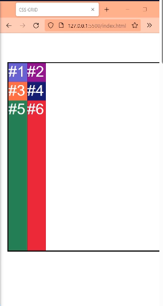
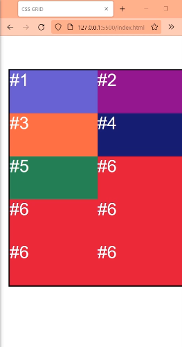
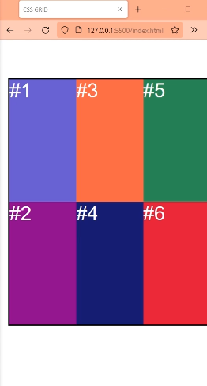
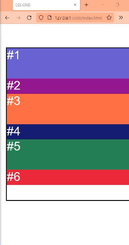

# Placement

Cuando posicionamos un grid-item, los demas elementos que le siguen (que todavia no los posicionamos) tambien se mueven. 

```css

item-2{
    grid-column:4;
}
```



`Los demas toman una posicion automatica. A esto se le llama placement`. Y en su mayoria se definen en la propiedad grid-auto-flow:


```css

.grid{
    display: grid;
    grid-template-columns: repeat(4,1fr); /*Crea 4 columnas*/
    grid-template-rows: repeat(4,1fr);
    /*Crea 4 filas*/

}
```

# grid-auto-flow:

Por defecto esta grid-auto-flow:row.

Pero si cambiamos a grid-auto-flow:column. El flujo se cambia a columnas y se enumeran asi




Esto significa que grid-auto-flow: nos indica para que lado se van a crear las celdas, de a una, a medida que se agregan en el html.

## grid-auto-flow:row 

Definido asi por defecto, se creaban celdas a la derecha en filas y cuando no habia mas espacio , la proxima celda se coloca en la fila siguiente.


## Con grid-auto-flow:column

Crea celdas hacia abajo y cuando no hay mas lugar , la celda nueva se coloca en la siguiente columna.


## grid-auto-flow: sin espacio explicito definido para las celdas.

Que pasa si ahora solo creamos 2 filas y 2 columnas, pero con 6 grid-item en html? 

```css

.grid{
    display: grid;
    grid-template-columns: repeat(2,1fr); /*Crea 4 columnas*/
    grid-template-rows: repeat(2,1fr);
    /*Crea 4 filas*/

}
```
```html
    <div class="grid">

        <div class="item item-1">#1</div>
        <div class="item item-2">#2</div>
        <div class="item item-3">#3</div>
        <div class="item item-4">#4</div>
        <div class="item item-5">#5</div>
        <div class="item item-6">#6</div>


    </div>
```



Se crean nuevas filas para los elementos que no tienen espacio explicito definido en la grid.
Se crean filas ya que por defecto grid-auto-flow:row.


Si agregamos mas elementos al html

```html
    <div class="grid">

        <div class="item item-1">#1</div>
        <div class="item item-2">#2</div>
        <div class="item item-3">#3</div>
        <div class="item item-4">#4</div>
        <div class="item item-5">#5</div>
        <div class="item item-6">#6</div>
        <div class="item item-6">#6</div>
        <div class="item item-6">#6</div>
        <div class="item item-6">#6</div>
        <div class="item item-6">#6</div>
        <div class="item item-6">#6</div>
        <div class="item item-6">#6</div>
        <div class="item item-6">#6</div>
        <div class="item item-6">#6</div>

    </div>
```

Se crean mas filas automaticamente, hasta completar todos los items del html.



Si cambiamos el grid-auto-flow:row por grid-auto-flow:column nos quedaria asi



Creando asi columnas automaticamente, por mas que el grid que hayamos definido inicialmente, fue para solo 4 celdas.


Pero como se puede observar los tracks, que se crean luego de completar el espacio explicito que definimos para el grid, son mas pequeños.


Analizando nuestro

```css

.grid{
    display: grid;
    grid-template-columns: repeat(2,1fr); /*Crea 4 columnas*/
    grid-template-rows: repeat(2,1fr);
    /*Crea 4 filas*/

}
```

Hicimos 2 columnas 2 dos filas como fracciones (1fr).
Que pasa si lo hacemos asi...

```css

.grid{
    display: grid;
    grid-template-columns: repeat(2,50px); /*Crea 4 columnas*/
    grid-template-rows: repeat(2,50px);
    /*Crea 4 filas*/

}
```


Ahora es distinto, al definir en px las nuevas columnas (o tracks) que se crean son mas anchas que las que definimos en nuestro css con grid.


Si cambiamos el grid-auto-flow:column por grid-auto-flow:row las nuevas filas que se crean son mas altas que las que definimos en px.




`Esto ocurre porque existe 2 nuevas propiedades que definen el tamaño de nuestras nuevas filas o columnas implicitas.`

`Para la propiedad por defecto grid-auto-flow:row tenemos grid-auto-rows:auto; y para grid-auto-flow:column tenemos grid-auto-columns:auto;`


## grid-auto-rows:

Define el tamaño que tendran las filas que se crean automaticamente.
Se crea cuando usamos la propiedad grid-auto-flow:row.

Por defecto grid-auto-rows: auto; 
El valor auto le dal el tamaño maximo para que el elemento exista y si sobra espacio, lo reparte entre todos los elementos que tengan el valor auto. Por eso el tamaño de las nuevas filas implicitas puede ser mas chico o mas grande porque lo hace auto.

`Entonces podemos definir el tamaño exacto que queremos colocarle a las nuevas filas que se crean automaticamente.`

Por ejemplo podemos decirle que las filas que se crean automaticamente midan 100px cambiando la propiedad que viene por defecto grid-auto-row:auto; en el contenedor grid .

Ejs:
grid-auto-row: 100px;

grid-auto-row: 1fr;




## grid-auto-columns:

Define el tamaño que tendran las columnas que se crean automaticamente.

Se crea cuando usamos la propiedad grid-auto-flow:column.

Por defecto grid-auto-columns:auto; 
El valor auto le dal el tamaño maximo para que el elemento exista y si sobra espacio, lo reparte entre todos los elementos que tengan el valor auto. Por eso el tamaño de las nuevas columnas implicitas puede ser mas chico o mas grande porque lo hace auto.

`Entonces podemos definir el tamaño exacto que queremos colocarle a las nuevas columnas que se crean automaticamente.`

Por ejemplo podemos decirle que las columnas que se crean automaticamente midan 30px cambiando la propiedad que viene por defecto grid-auto-columns:auto; en el contenedor grid.

Ejs:
grid-auto-columns:30px;

grid-auto-columns: 1fr;



*Notar que se crearon nuevas columnas implicitas con tamaño 1 fr, siendo que habiamos definido solo 4 columnas en nuestro css*

```css

.grid{
    display: grid;
    grid-template-columns: repeat(2,1fr); /*Crea 4 columnas*/
    grid-template-rows: repeat(2,1fr);
    /*Crea 4 filas*/
    grid-auto-columns: 1fr;
    /*Quedando de esta forma las 4 celdas definidas en 1fr y las proximas implicitas tambien en 1fr*/

}
```


## Ejemplo de utilidad

Podemos escribir esto

grid-auto-flow:row;
grid-auto-rows: 100px 50px;

Y las segundas filas que se creen seran diferentes.




Tambien lo podemos hacer en columnas.
grid-auto-flow:column;
grid-auto-columns: 100px 50px;
