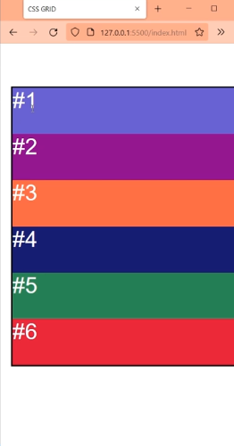
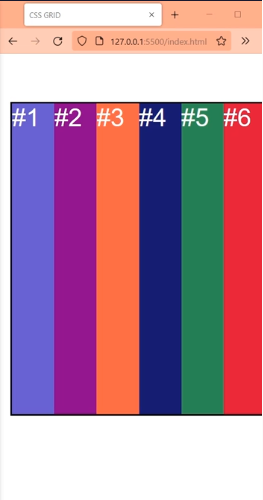
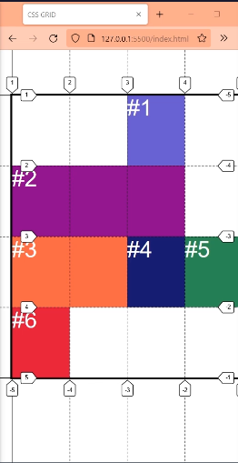

# Repaso

Algoritmo de ubicacion de CSS Grid.

Primero se ubican los elementos que se posicionan con propiedades, como grid-column: ; grid-row; ; grid-area: ;.

Los elementos que tienen una linea span sin una linea definida ya sea de inicio o de final, pueden cambiar su posicion de la grid de acuerdo al flujo .

Despues se ubican de acuerdo al orden del html.
Si el flujo es en filas grid-auto-flow:row; las filas se ubican una debajo de la otra. 
(Sin definir grid-template-columns: ni grid-template-rows:)




Si el flujo es en columnas grid-auto-flow:column; las columnas se ubican una a la derecha de la otra. 
(Sin definir grid-template-columns: ni grid-template-rows:)




# Ejemplo de posicionamiento por defecto

Tenemos un CSS Y UN HTML asi:

```html

    <div class="grid">

        <div class="item item-1">#1</div>
        <div class="item item-2">#2</div>
        <div class="item item-3">#3</div>
        <div class="item item-4">#4</div>
        <div class="item item-5">#5</div>
        <div class="item item-6">#6</div>


    </div>
```

```css

.grid{
    display: grid;
    grid-template-columns: repeat(4,1fr);
    grid-template-rows: repeat(4,1fr);

    width: 90%;
    max-width: 600px;
    margin: 80px auto;
    overflow: hidden;
    outline: 3px solid;
    height: 500px;
}

.item-1{
    grid-column: 3 ;
    background-color: slateblue;
}
.item-2{
    grid-column:span 3;
    background-color: darkmagenta;

}
.item-3{
    background-color: tomato;
    grid-column:span 2;
}

.item-4{
    background-color: midnightblue;
}

.item-5{
    background-color: seagreen;
}

.item-6{
    background-color: crimson;
}


```

Lo que hicimos fue posicionar el primer grid-item a partir de la 3 linea.
El segundo le ponemos que ocupe 3 tracks con span 3, y al tercero que ocupe 2 tracks con span 2.
Y los demas no los tocamos.



Como podemos observar los elementos que le siguen al grid-item 1,como no entran se posicionan cuando encuentran lugar para el total de tracks. Pero de esta manera se generan espacios en blanco.
Este es el ordenamiento por defecto.


## grid-auto-flow: dense

Con esta propiedad definida en dense en el contenedor padre, el algoritmo de CSS Grid va a intentar llenar los espacios.

*Por defecto esta en grid-auto-flow:row; ya usamos grid-auto-flow:column; y ahora dense se puede poner solo ya que flow esta en row por defecto. Tambien podriamos escribirlo grid-auto-flow: colomun dense*


`Intenta ordenar de acuerdo al orden del HTML, pero cuando el elemento no entra, busca el siguiente que esta en el HTML que pueda llenar los espacios vacios en orden.`


Lo mismo pasa si definimos un grid-auto-flow: colomun dense;


## order:

Como en flexbox, tambien podemos definir la propiedad order: en cada uno de los grid-items , con el numero de valor mas bajo siempre se ordenara primero y los de mayor valor al final.

