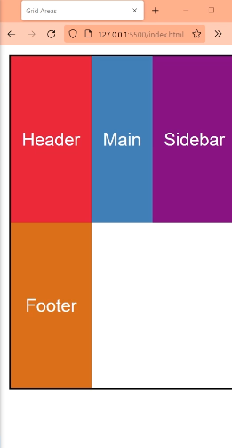
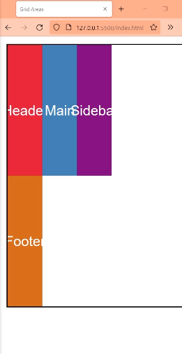

# Trabajamos en la carpeta grid-areas que esta dentro de la carpeta CSS GRID 
```html

    <main class="grid">

        
        <section class="item header">Header</section>

        <section class="item main">Main</section>

        <section class="item sidebar">Sidebar</section>


        <section class="item footer">Footer</section>

    </main>

```


`Ya vimos como posicionar grid-items con lineas, ahora vamos a usar areas.`


# grid-template-areas:

`Propiedad que se coloca en el contenedor padre, donde esta el display:grid.`
Funciona incluso si no definimos grid-template-columns:; ni grid-template-rows: ;

Se colocan comillas para crear cada fila, y nombres por cada columna que queramos crear. Independientemente de la cantidad de elementos que hayamos colocado en el html.

grid-template-areas: "juan jesus" ;


O con 3 nombres...

grid-template-areas: "juan jesus victor" ;

De esta forma solo entran 3 grid-item por cada fila, por eso deja espacios vacios.




Recordamos la propiedad grid-auto-columns: que por defecto esta en auto, entonces las columnas ocupan lo mismo pero si la colocamos en px...

grid-auto-columns:80px;



`Podemos crear la cantidad de columnas que querramos por cada nombre que inventemos.`


## Crear mas filas

Si queremos crear mas filas, solo hay que colocar mas comillas , pero con la cantidad exacta de nombres de la primer fila original,sino no funciona.

grid-template-areas: "juan jesus victor" "enrique enrique enrique" "roberto roberto roberto"; 

Si le damos Enter por cada fila es mas legible.

grid-template-areas: 
"juan jesus victor" 
"enrique enrique enrique" 
"roberto roberto roberto"; 


`Lo que creamos en el grid-template-areas: son espacios vacios. Las celdas se crean con el html.`


## grid-area:

Anteriormente este era el shorthand de los grid-items.

`grid-area: row-start / column-start / row-end / column-end`

`grid-area: fila-inicio / columna-inicio / fila-final / columna-final` 

Pero tambien sirve para referenciar el area que ocuparan los grid-items usando solo los nombres.

Por ejemplo si colocamos en los grid-items...


```css

.header{
    grid-area: roberto;
    background-color: crimson;
}

.main{
    grid-area: enrique;
    background-color: steelblue;
}

```


`De esta forma hacemos que nuestros grid-items ocupen una area completa con varias celdas. Sin usar las propiedades grid-column: y grid-row: para decirle desde donde hasta donde con lineas. `


