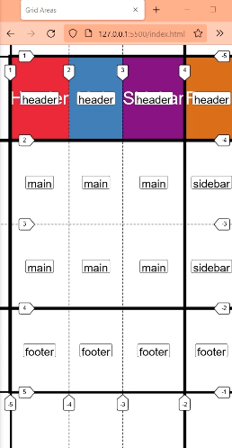
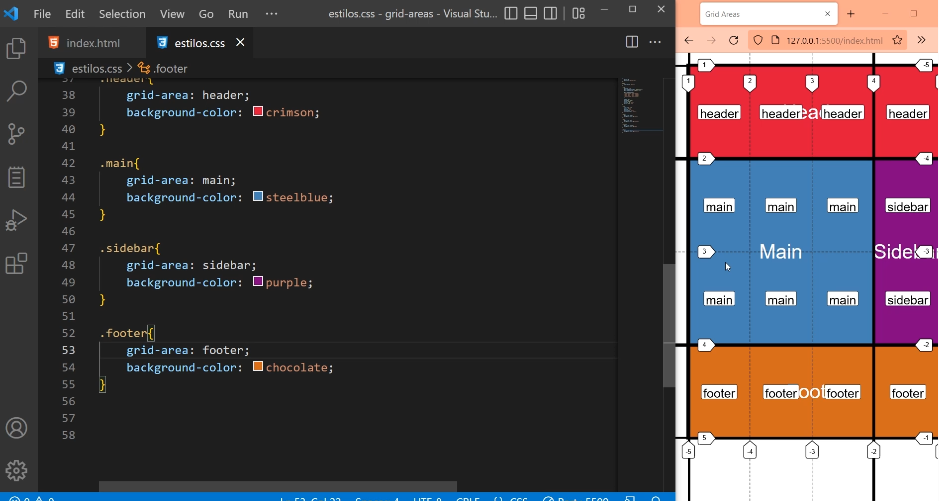
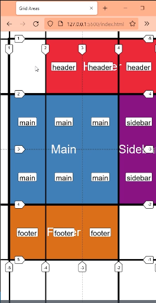

# Grid Template areas

Las areas solo pueden ser rectangulares, no en L ni otra forma rara.


# Creamos un Layout

Como le gusta trabar al profe

No necesariamente hacen falta usar todas las propiedades juntas. Pero puede verse mas ordenado.

- Crear primero las filas y columnas con grid-template-columns: ; y grid-template-rows:


grid-template-columns: repeat(4,1fr);
grid-template-rows:repeat(4,1fr);


- Luego definir el grid-template-areas: 


grid-template-areas: 
"header header header header"
"main   main   main   sidebar "
"main   main   main   sidebar"
"footer footer footer footer";


Creamos los espacios vacios para luego llegarlo con los grid-items



Ahora con los grid-items que definimos en el html, ocupamos esos espacios vacios...

```css


.header{
    grid-area: header;
  
    background-color: crimson;
}

.main{
    grid-area: main;
    background-color: steelblue;
}

.sidebar{
    
    grid-area: header;
    background-color: purple;
}

.footer{
    grid-area: footer;
    background-color: chocolate;
}

```

Colocamos en cada grid-item la propiedad grid-area: para definir el espacio que ocuparan.




Si queremos dejar algun espacio en blanco usamos un punto en el grid-template-areas: ; 

grid-template-areas: 
".      header header header"
"main   main   main   sidebar "
"main   main   main   sidebar"
"footer footer footer .";




Si colocamos un punto en algun lugar que desarma un rectangulo , grid se rompe y no funciona


## Creamos una vista para mobile

- Pasamos lo que hicimos al media queries

```css

@media (min-width: 700px) {
    .grid{
        grid-template-columns: repeat(4,1fr);
        grid-template-rows: repeat(4,1fr);
        
        grid-template-areas: 
        "header header header header"
        "main   main   main   sidebar"
        "main   main   main   sidebar"
        "footer footer footer footer"
    ;
    }
}
```

- Cambiamos el .grid que hicimos para colocar ahi la vista de mobile
Cambiamos grid-template-columns:; grid-template-rows:; y grid-template-areas: 

```css

.grid{
    display: grid;
    gap: 1em;
    /*Creamos el esqueleto*/
    grid-template-columns: 1fr;/*Una columna*/
    grid-template-rows:repeat(4,1fr);/*4 filas*/
    grid-template-areas: 
    "header"
    "main"
    "sidebar"
    "footer"
    ;
    
    width: 90%;
    max-width: 700px;
    height: 600px;
    outline: 3px solid;
    margin: 20px auto;
}
```


Tampoco se puede definir un area con un nombre repetido, que este separada.Se rompe.
Por ejemplo:

    grid-template-areas: 
    "header"
    "main"
    "header"
    "footer"
    ;

Pero si se puede colocar en los grid-items el mismo nombre de una area. Es decir le decimos a un elemento del html que ocupe un mismo lugar en nuestro esqueleto.
Y ahi podemos usar la propiedad z-index para definir cual esta encima.


