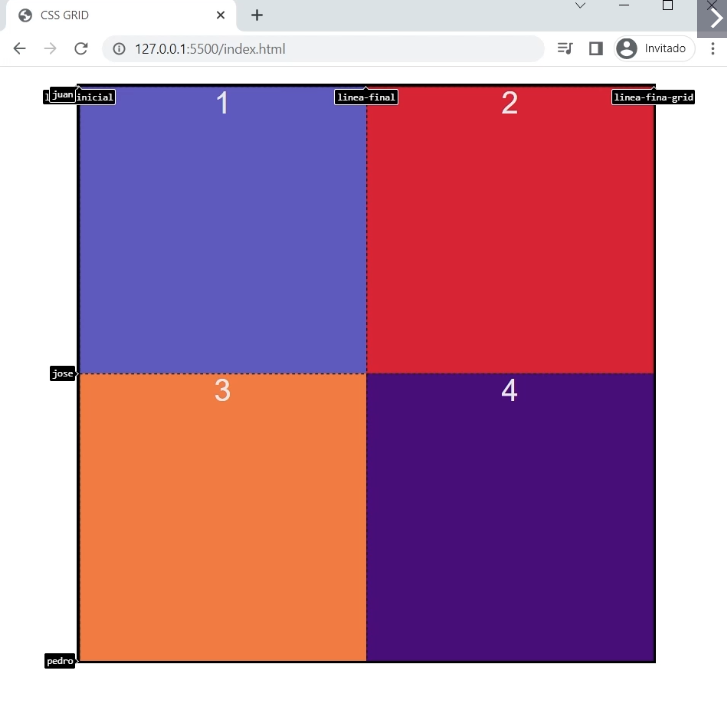
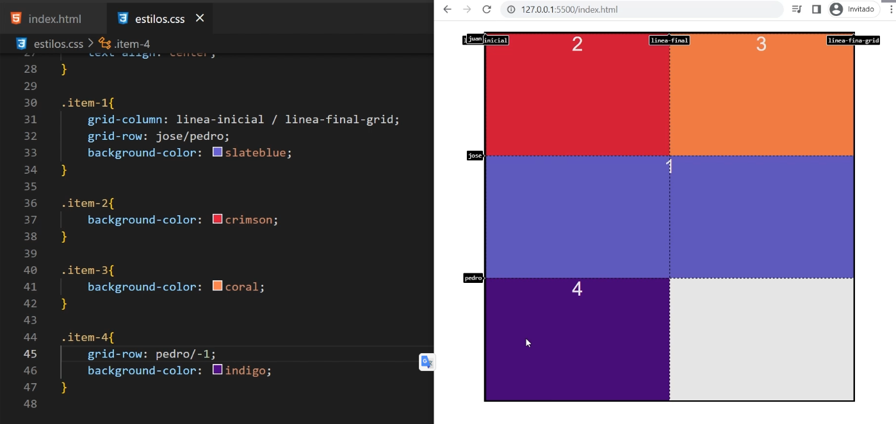

# Trabajamos en la carpeta grid-avanzado

# Le colocamos nombres a las lineas

En chrome hay que buscar la opcion layout, show lines names y hacerle tilde para poder verlas.

En el contenedor donde se define el display:grid; se realiza lo siguiente...

En la propiedad grid-template-columns:; se le puede poner nombre a las lineas de columnas.
En la propiedad grid-template-rows:; se le puede poner nombre a las lineas de filas.

Se van colocanto entre los tracks que fuimos creando.
Los nombres no pueden tener un espacio en el medio, un guion podria usarse. Se colocan entre corchetes.

```css

grid-template-columns:[linea-inicial] 1fr [linea-final] 1fr [linea-final-grid];
grid-template-rows: [juan] 1fr [jose]  1fr [pedro];

```


Para estos casos no usamos repeat, para poder colocarle nombres a las lineas.

Para el siguiente ejemplo creamos una linea mas, colocando 1fr al final de rows.

```css
grid-template-columns:[linea-inicial] 1fr [linea-final] 1fr [linea-final-grid];
grid-template-rows: [juan] 1fr [jose]  1fr [pedro] 1fr;


```


Y en los grid-items posicionamos con grid-column: y grid-row:
En vez de los numeros usamos los nombres que creamos.


```css

.item-1{
    
     grid-column: linea-inicial / linea-final-grid; 
     grid-row: jose / pedro; 

    background-color: slateblue;

}

.item-2{
    background-color: crimson;

}

.item-3{

    background-color: coral;
}

.item-4{
    /*Mezclamos posicionamiento con nombres y numeros*/
    grid-row: pedro / -1; 
    background-color: indigo;
}


```

