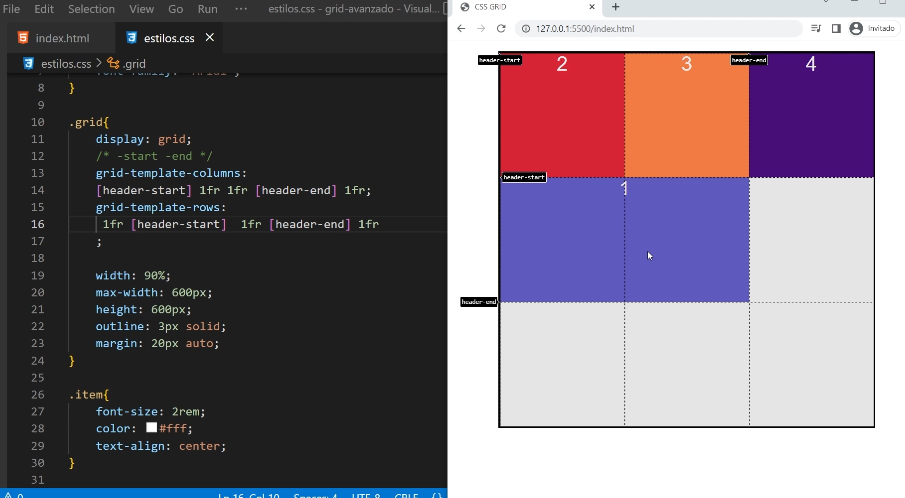

# Consejo para nombrar lienas

- Colocar nombres a las lineas que nos interesen
- Los nombres es aconsejable que se relacionen al area. Es decir darle un nombre semantico. Ej: header, footer, sidebar.
- Usar los sufijos -start y -end

Ejemplo poniendo los mismos nombres a las lineas de columnas y a las lineas de filas:

```css
.grid{

    display:grid;
    grid-template-columns:[header-start] 1fr 1fr [header-end] 1fr ;
    grid-template-rows: 1fr [header-start] 1fr [header-end] 1fr;

}

/*Y posicionamos los grid-items*/
.item-1{
    
     grid-column: header-start / header-end; 
     grid-row: header-start / header-end; 

    background-color: slateblue;

}

.item-2{
    background-color: crimson;

}

.item-3{

    background-color: coral;
}

.item-4{
  
    background-color: indigo;
}


``` 




Que pasa ahora si queremos usar esas mismas lineas para el footer.
Estariamos usando header-start o header-end y eso no seria muy explicativo. Se pueden agregar mas nombres a las lineas asi:


```css
.grid{

    display:grid;
    grid-template-columns:
    [header-start footer-start] 1fr 1fr [header-end] 1fr [footer-end];

    grid-template-rows: 
    1fr [header-start] 1fr [header-end footer-start] 1fr [footer-end];

}

/*Y posicionamos los grid-items*/
.item-1{
    
    grid-column: header-start / header-end; 
    grid-row: header-start / header-end; 

    background-color: slateblue;

}

.item-2{
    
    grid-column: footer-start / footer-end; 
    grid-row: footer-start / footer-end; 

    background-color: crimson;

}

.item-3{

    background-color: coral;
}

.item-4{
  
    background-color: indigo;
}


``` 


`Utilizar esta convencion con los sufijos -start y -end tiene otra utilidad que es crear areas implicitas.`


# Areas implicitas

Entonces en vez de referenciar un area usando en los grid-items grid-column: y grid-row: ; podemos usar directamente la propiedad grid-area:

En el grid item cambiamos esto...

```css

.item-1{
    
    grid-column: header-start / header-end; 
    grid-row: header-start / header-end; 

    background-color: slateblue;

}

.item-2{
    
    grid-column: footer-start / footer-end; 
    grid-row: footer-start / footer-end; 

    background-color: crimson;

}

```


por esto y es lo mismo...


```css


.item-1{
    
    grid-area: header;
    background-color: slateblue;

}

.item-2{
    
    grid-area: footer;

    background-color: crimson;

}

```


