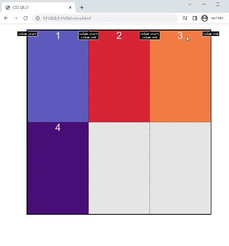
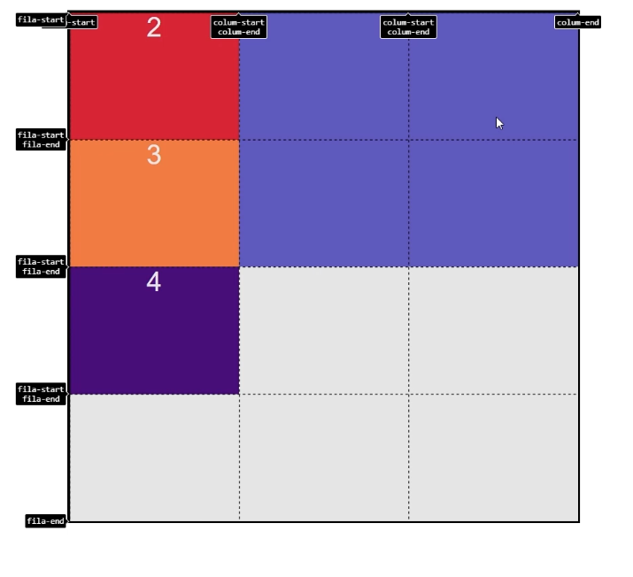
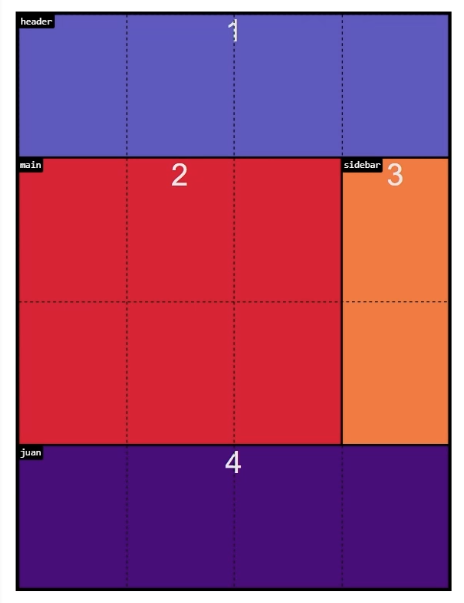

# Nombrando lineas con repeat

Si queremos darle nombres a muchas lineas podemos usar la funcion repeat() , pero hay que tener en cuenta que se repiten los nombres. Ya que si se pone uno solo las lineas siempre se llamarian start.

```css

.grid{
    display:grid;
    grid-template-columns:repeat(3,[column-start] 1fr [column-end])
}

```

Lo que estaria generando el repeat() en este caso seria lo mismo que:


[column-start] 1fr [column-end] [column-start] 1fr [column-end] [column-start] 1fr [column-end]




Hacemos lo mismo para las filas:

```css

.grid{
    display:grid;
    grid-template-columns: repeat(3,[column-start] 1fr [column-end])
    grid-template-row: repeat(4,[fila-start] 1fr [fila-end])
}

```

## Posicionando un grid-item

Para posicionar por nombres de lineas se realiza con grid-column: y grid-row: pero ademas del nombre se deberia colocar el numero de linea como antes.

```css

.item-1{

    grid-column: colum-start 2 / colum-end 3;
    grid-row:fila-start/fila-start 3; 
 

}

```



## Posicionamos los grid-items utilizando lineas con nombres implicitos

Si usamos la propiedad para crear areas, es decir el grid-template-areas: ; se crean nombres implicitos para las lineas, con el nombre que pusimos en el template y agregando el sufijo -start o el sufijo -end.

```css

.grid{
    display:grid;
    grid-template-columns: repeat(3,1fr);
    grid-template-row: repeat(4,1fr);
    grid-template-areas:
    "header header header header"
    "main main main sidebar"
    "main main main sidebar"
    "juan juan juan juan"
}

```

Entonces podemos posicionar los grid-items con nombres de lineas sin haberlas definido:


```css

.item-1{
     grid-column: header-start / header-end; 
     grid-row: header-start / header-end; 

    background-color: slateblue;

}

.item-2{
    grid-column: main-start / main-end;
    grid-row: main-start / main-end;
    
    background-color: crimson;


}

.item-3{
    grid-column: sidebar-start / sidebar-end; 
    grid-row: sidebar-start / sidebar-end; 
    background-color: coral;
}

.item-4{
    grid-column: juan-start / juan-end;
    grid-row: juan-start / juan-end; 
    background-color: indigo;
}


```

