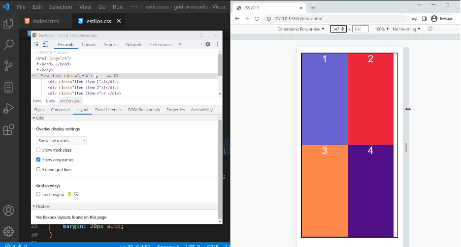

# auto-fill y auto-fit

`Son propiedades que permite adaptar el contenido sin media queries`


# auto-fill

Sirve para crear tantas columnas o filas posibles, como el espacio disponible nos permita.

Se utiliza en la propiedad grid-template-columns:, grid-template-rows:

En este caso la vamos a usar en la funcion repeat() en vez de poner como primer argumento la cantidad colocamos auto-fill

Ej1: 

```css

.grid {
    grid-template-columns: repeat(auto-fill, 150px);
}
```

Podemos ir agrandando la pantalla con el navegador y vamos viendo en px como se crean columnas





Hasta el punto de llegar a crear mas columnas de las que tenemos designadas en el html


Tambien podemos usar porcentajes por ejemplo:

Ej2: 

```css

.grid {
    grid-template-columns: repeat(auto-fill, 10%);
}
```

Y crear 10 columnas del 10% cada una


Tambien podemos combinar auto-fill con la funcion minmax()

Ej3: 

```css

.grid {
    grid-template-columns: repeat(auto-fill, minmax(200px,1fr));
}
```


Entonces aca repeat va a crear varias columnas. Cuantas? Lo define el primer argumento, crea columnas automaticas con auto-fill.
Cuanto va a medir cada columna?
No van a medir menos de 200px. Por lo que si el espacio disponible es mayor a 200px pero menor a 400px ya no entran 2 columnas. Entonces el espacio restante lo define 1fr. 


 - 1.png>)


 - 2.png>)

Asi sucesivamente hasta crear mas columnas de las que tenemos definidas en el html.

 - 3.png>)

`Entonces podemos utilizar una nueva propiedad que resuelve ese problema que es auto-fit.`


# auto-fit

Funciona exactamente igual pero soluciona el problema de las columnas extras.
Crea tantas columnas o filas que vayamos a necesitar. Las columnas y filas que esten vacias las elimina.

Ej4: 

```css

.grid {
    grid-template-columns: repeat(auto-fit, minmax(200px,1fr));
}
```


