# Alineacion en la Grid

`Todas las propiedades para centrar se colocan en el contenedor padre .grid`

## Para alinear los hijos grid-items

Estas propiedades funcionan solo si hay espacio disponible.
Si colocamos un width:100% o height:100% en los hijos grid-items, estas propiedades pierden el efecto ya que no queda espacio disponible.
Cuando las usamos los grid-items pasan a adaptarse al contenido del html.

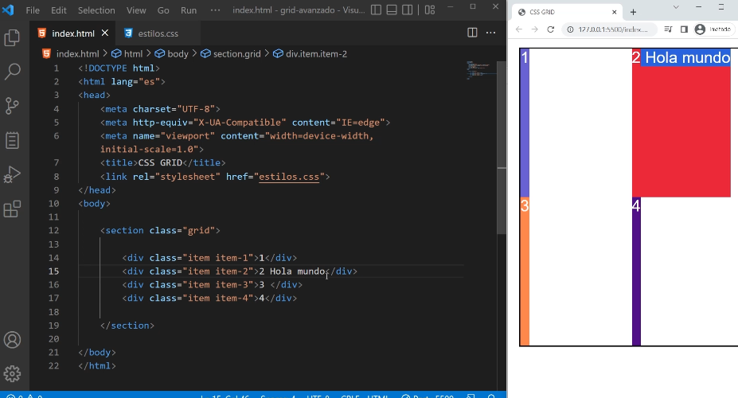

```css

.grid{
    display: grid;
    grid-template-columns:repeat(2,1fr);
    grid-template-rows: repeat(2,1fr); 
    

    /* justify-content: space-evenly;  */
    /* align-content: space-evenly; */

    /* place-content:center; */

    /* justify-items: center; */
    /* align-items: center; */
    /* place-items: align justify; */

    width: 90%;
    height: 600px;
    outline: 3px solid;
    margin: 20px auto;
}
```

### justify-items: 

`Permite alinear a los grid-items en filas.` Es decir de izquierda a derecha.
Por defecto esta en stretch, que estira a los grid-items por todo el ancho de la celda.

justify-items: start; // Envia el contenido al comienzo a la izquierda.
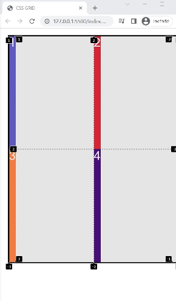

justify-items: end; // Envia el contenido al final a la derecha.
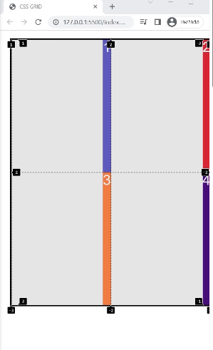

justify-items: center; // Envia el contenido al centro de izquierda a derecha.
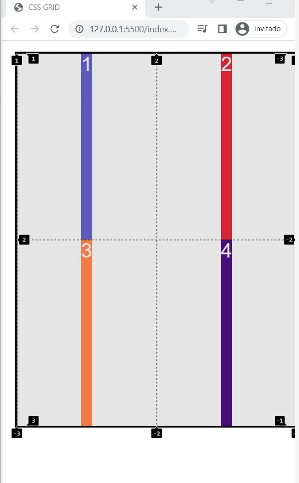


### align-items:

`Permite alinear a los grid-items en columnas`. Es decir de arriba hacia abajo.
Por defecto esta en stretch, que estira a los grid-items por todo el alto de la celda.

align-items: start; // Envia el contenido al comienzo hacia arriba.
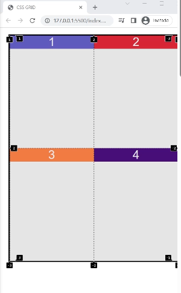

align-items: end; // Envia el contenido al final hacia abajo.
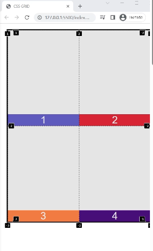

align-items: center; // Envia el contenido al centro de arriba hacia abajo.
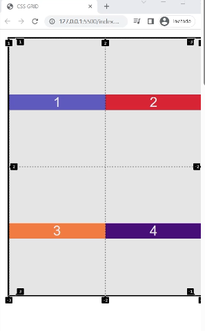

align-items: baseline; // Alinea los elementos en base a la linea base del texto.
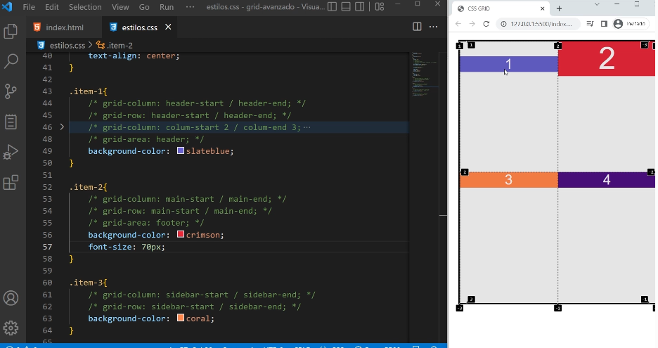

### place-items:

Es un shorthand de align-items: y justify-items:  . place-items: recibe 2 valores el primero es el de columnas align-items: y el segundo de filas justify-items:. Si colocamos un solo valor repite en ambos.

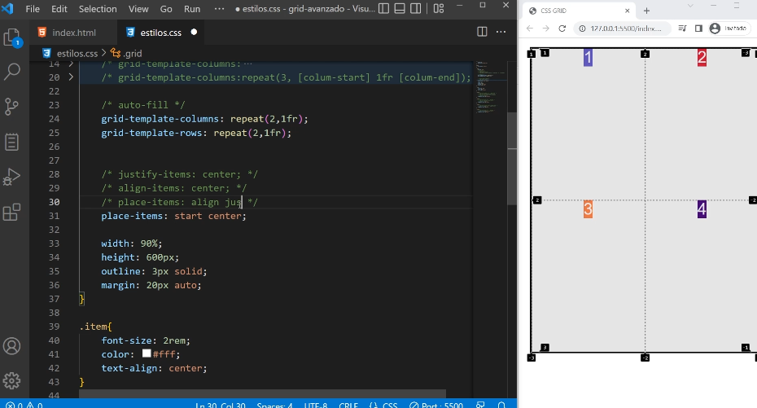


## Para alinear el contenedor grid

Existen 2 propiedades justify-content: y align-content:.
Debe existir espacio displonible en el contenedor.

Para aplicar estas propiedades cambiamos el ancho y el alto de las filas, que era 1fr, por px para generar espacio disponible en el contenedor.

```css

.grid{
    display: grid;
    grid-template-columns:repeat(2,150px);
    grid-template-rows: repeat(2,150px); 
    

    /* justify-content: space-evenly;  */
    /* align-content: space-evenly; */

    /* place-content:center; */

    /* justify-items: center; */
    /* align-items: center; */
    /* place-items: align justify; */

    width: 90%;
    height: 600px;
    outline: 3px solid;
    margin: 20px auto;
}
```


### justify-content:

Permite alinear a la grid a lo largo del eje en filas, es decir horizontalmente.
Por defecto esta en stretch, que estira la grid por todo el ancho del contenedor.

justify-content:start // Envia la grid al comienzo del contenedor mirando de izquierda a derecha.
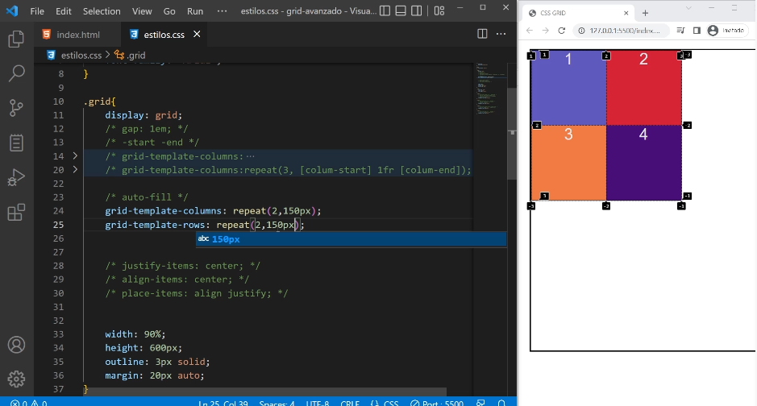

justify-content:end // Envia la grid al final del contenedor mirando de izquierda a derecha.
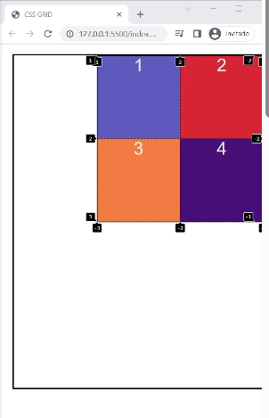

justify-content:center // Envia la grid al centro del contenedor mirando de izquierda a derecha.
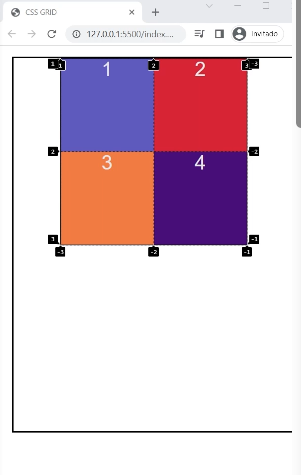


justify-content:space-around // Reparte el espacio sobrante de manera equitativa entre los grid-items, mirando de izquierda a derecha. Coloca espacios al comienzo y al final de cada grid-item,entre ambos se superponen 2 espacios.

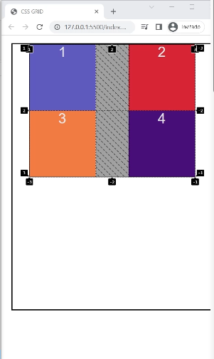

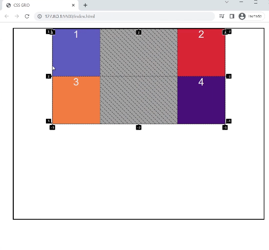


justify-content:space-between // Reparte el espacio sobrante de manera equitativa entre los grid-items, mirando de izquierda a derecha. Coloca espacios al comienzo y al final de cada grid-item, menos en el primer y el ultimo grid-item.

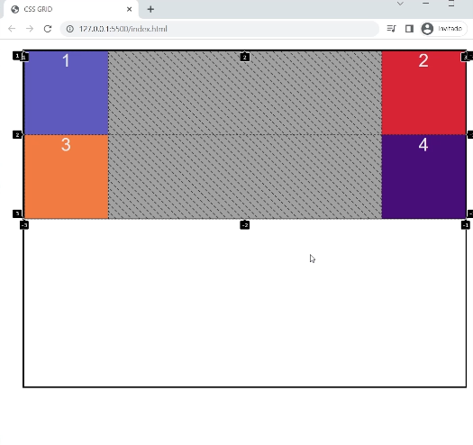


justify-content:space-evenly // Reparte el espacio sobrante de manera equitativa entre los grid-items, mirando de izquierda a derecha. Coloca espacios al comienzo y al final de cada grid-item, todos exactamente iguales.

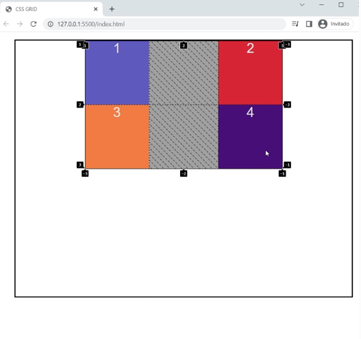


### align-content:

Permite alinear a la grid a lo largo del eje en columnas, es decir verticalmente.
Por defecto esta en stretch, que estira la grid por todo el alto del contenedor.


align-content:start // Envia la grid al comienzo del contenedor mirando de arriba hacia abajo.
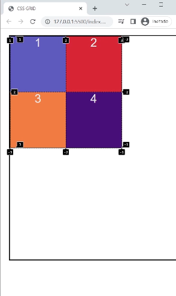

align-content:end // Envia la grid al final del contenedor mirando de arriba hacia abajo.
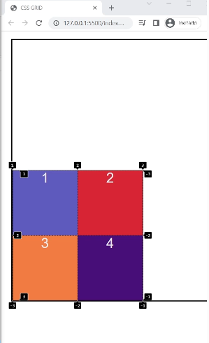

align-content:center // Envia la grid al centro del contenedor mirando de arriba hacia abajo.
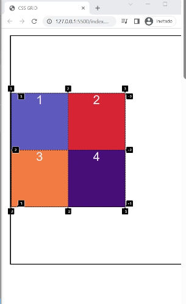


align-content:space-around // Reparte el espacio sobrante de manera equitativa entre los grid-items, mirando de arriba hacia abajo. Coloca espacios al comienzo y al final de cada grid-item,entre ambos se superponen 2 espacios.

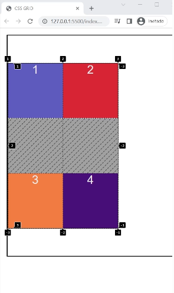


align-content:space-between // Reparte el espacio sobrante de manera equitativa entre los grid-items, mirando de arriba hacia abajo. Coloca espacios al comienzo y al final de cada grid-item, menos en el primer y el ultimo grid-item.

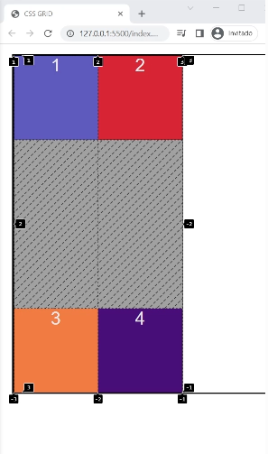


align-content:space-evenly // Reparte el espacio sobrante de manera equitativa entre los grid-items, mirando de arriba hacia abajo. Coloca espacios al comienzo y al final de cada grid-item, todos exactamente iguales.

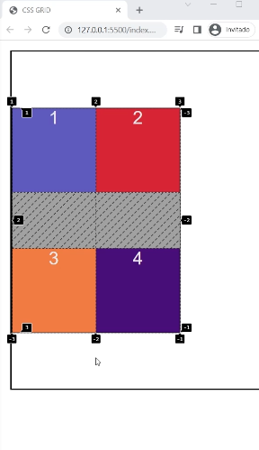


### place-content:

Es el shorthand de align-content: y justify-content:.
place-content: recibe 2 valores, el primero es el de columnas align-content: y el segundo de filas justify-content:. Si colocamos un solo valor repite en ambos.


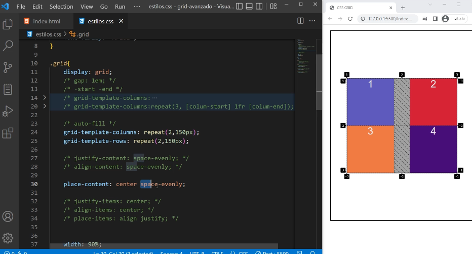