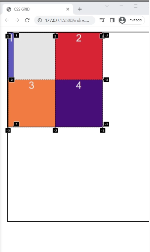
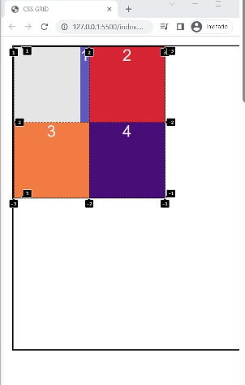
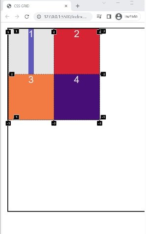
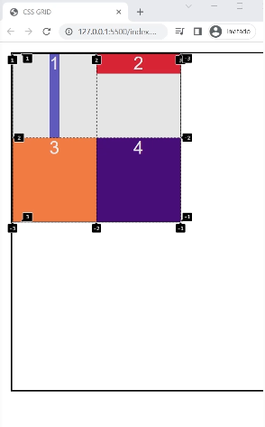
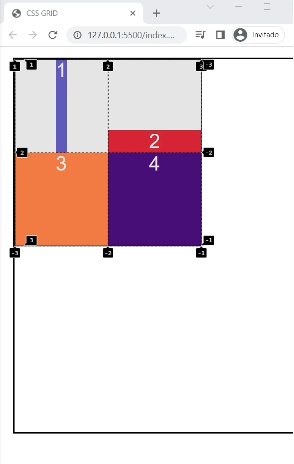
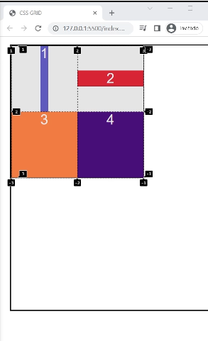
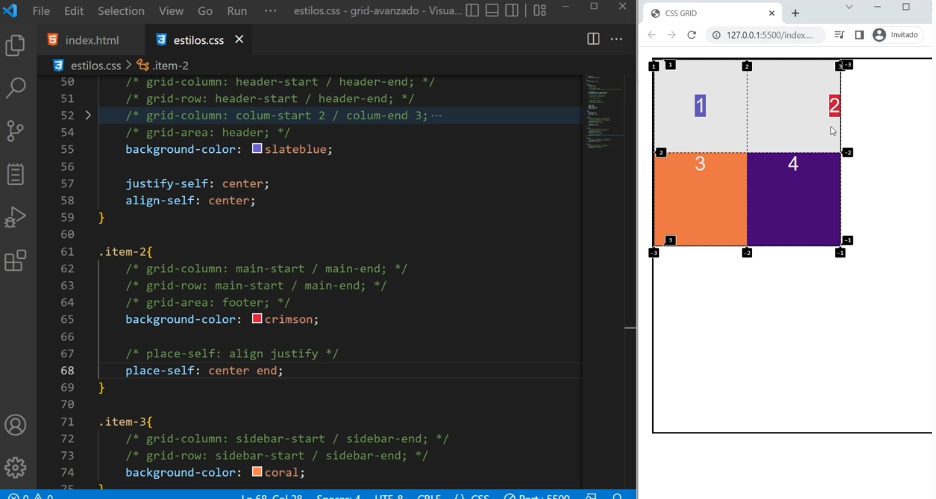

# justify-self: y align-self: 

Propiedades para alinear los hijos grid-items en base a su celda.
Se colocan directamente en los grid-items.

## justify-self: 

Permite alinear al grid-item en base a su celda horizontalmente , es decir en filas.

Por defecto esta en stretch que estira el grid-item por todo el ancho de la celda.

```css

.item-1{
    
    background-color: slateblue;
  /*
    justify-self:center;
    justify-self:start;
    justify-self:end; 
   */

}

```

justify-self:start; // Envia el grid-item al comienzo a la izquierda.


justify-self: end; // Envia el grid-item al final a la derecha.


justify-self: center; // Envia el grid-item al centro de izquierda a derecha.



## align-self: 

Permite alinear al grid-item en base a su celda verticalmente , es decir en columnas.

Por defecto esta en stretch que estira el grid-item por todo el alto de la celda.

.item-2{
 
    background-color: crimson;

     /*
    align-self:center;
    align-self:start;
    align-self:end; 
   */ 
     
}


align-self:start; // Envia el grid-item al comienzo mirando de arriba hacia abajo.


align-self: end; // Envia el grid-item al final mirando de arriba hacia abajo.


align-self: center; // Envia el grid-item al centro mirando de arriba hacia abajo.



## place-self:

Es el shorthand de align-self: y justify-self:.
place-self: recibe 2 valores, el primero es el de columnas align-self: y el segundo de filas justify-self:. Si colocamos un solo valor repite en ambos.

