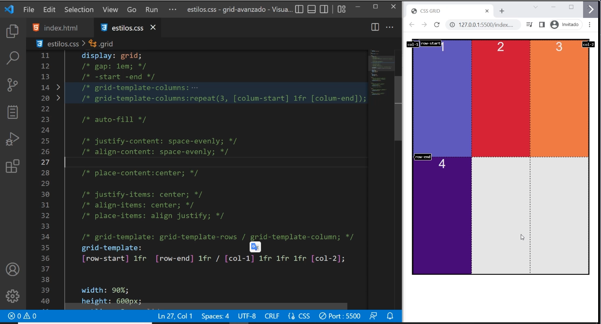
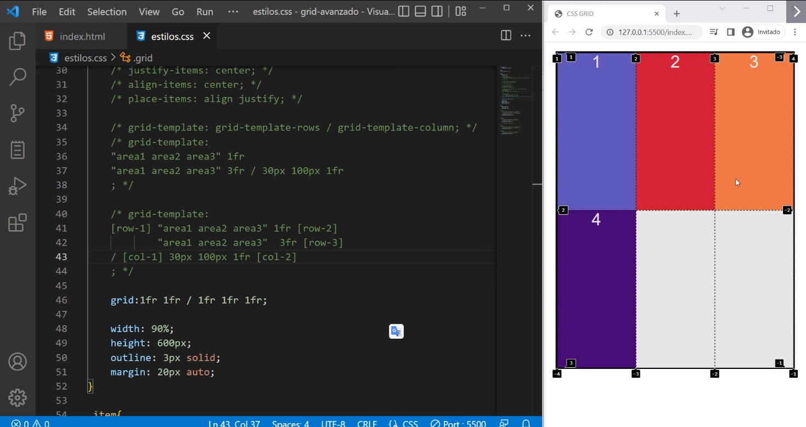

# Otros shorthands en Grid

No son tan intuitivos, requiere experiencia usarlos.
Lo recomendable es colocar todas las propiedades ya aprendidas de a una.


## grid-template

Shorthand de grid-template-rows y grid-template-column
Se separan por una diagonal. Valores de filas / Valores de columnas.


Ejemplo con distintas medidas:

```css

.grid{
    display: grid;


     grid-template: 1fr 1fr 80px / 100px 30% 1fr 1fr;
     /*Creamos 3 filas y 4 columnas*/
   /*   grid-template: grid-template-rows / grid-template-column;  */

}

```


Ejemplo con repeat:


```css

.grid{
    display: grid;

grid-template: repeat(3, minmax(20px,1fr)) / repeat (8,1fr);

}

```


Ejemplo nombrano lineas:

```css

.grid{
    display: grid;

grid-template: [row-start] 1fr [row-end] 1fr / [col-1] 1fr 1fr 1fr [col-2];

}

```



## grid-template usando areas

Es una forma de usar el mismo shorthand pero en vez de referirse a grid-template-rows y grid-template-column se refiere a grid-template-areas.


```css

.grid{
    display: grid;

grid-template: 
"area1 area2 area3"
"area1 area2 area3"

}

```


Pero tambien podemos definir el tamaño de las filas y columnas, colocando el tamaño del track:


```css

.grid{
    display: grid;

grid-template: 
"area1 area2 area3" 1fr
"area1 area2 area3" 2fr

}

```


Ejemplo definiendo el tamaño de cada columna:


```css

.grid{
    display: grid;

grid-template: 
"area1 area2 area3" 1fr
"area1 area2 area3" 3fr / 30px 100px 1fr

}

```


Esto que acabamos de hacer es lo mismo que hacer sin shorthands de la siguiente manera:


```css

.grid{
    display: grid;

grid-template: 
"area1 area2 area3" 1fr
"area1 area2 area3" 3fr / 30px 100px 1fr


 grid-template-rows: 1fr 3fr;
 grid-template-column: 30px 100px 1fr;
}

```


Tambien podemos colocar nombre a las lineas:

```css

.grid{
    display: grid;

grid-template: 
[row-1] "area1 area2 area3" 1fr [row-2]
"area1 area2 area3" 3fr [row-3] / [col-1] 30px 100px 1fr [col-2]

}

```


Si vamos al inspector podemos desarmar algo asi para poder entenderlo y lo hace sin shorthands, si apretamos encima de grid-template.


## grid

Es otro shorthand muy similar a grid-template, funciona casi igual.

```css

.grid{
    display: grid;

grid-template: 1fr 1fr / 1fr 1fr 1fr;

}

```



La diferencia esta que ademas nos permite manipular lo que esta implicito, lo que viene por defecto automatico.

Es decir permite manejar lo explicito que es
grid-template-row: , grid-template-column: , y grid-template-areas:

Y lo implicito
grid-auto-rows: , grid-auto-columns: y grid-auto-flow:

Pero hay que elegir uno, vamos a lo implicito ya que lo explicito lo manejamos con el shorthand grid-template: 


### auto-flow

**Vamos a usar una propiedad que se llama auto-flow**

Ejemplo usando flujo en filas:

```css

.grid{
   display: grid;

   grid-template: auto-flow 50px 1fr / 1fr 1fr 1fr;

}

```


Ejemplo usando flujo en columnas:

```css

.grid{
  display: grid;

  grid-template: 50px 1fr / auto-flow 1fr 1fr 1fr;

}

```


Ejemplo agregando dense:

Para usar dense se debe colocar si o si la propiedad auto-flow antes.


```css

.grid{
  display: grid;

  grid-template: auto-flow dense 50px 1fr / 1fr 1fr 1fr;

}

```

