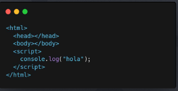

# ¿Qué es Javascript?

JavaScript fue diseñado para hacer páginas web interactivas. Permite a los desarrolladores implementar características complejas que se ejecutan en el navegador del usuario.
Es un lenguaje de programación de alto nivel, de tipos dinámicos, interpretado y orientado a objetos.

## ¿Cómo funciona javascript?

Hoy en día, JavaScript no solo se usa en el navegador frontend, sino también en el servidor backend gracias a entornos como Node.js, y en el desarrollo de aplicaciones móviles, juegos, y mucho más.

https://codigofacilito.com/cursos/nodejs-profesional

https://codigofacilito.com/bootcamps/javascript-backend

## Javascript en desarrollo frontend

## Empecemos a trabajar

Para incluir javascript en nuestro proyecto web utilizamos la etiqueta 

Cuando el código se empieza a complejizar tener todo en un solo archivo no es buena idea, por eso podemos utilizar el atributo src <script src=”[ARCHIVO_EXTERNO]”>

---

## Sintaxis básica

### Tipos de datos

Un dato en javascript puede ser muchas cosas. A los tipos de datos básicos se los llama primitivos y son:

● Números: 2, 100, 3.14
● Cadenas de caracteres: “A”, “Buenos días”, “23”
● Booleanos: true, false
● null
● undefined

### Variables

**var** son variables globales que se pueden volver a modificar.

**let** no se puede redeclarar en un mismo entorno. Por eso se usa mas let, no se puede redefinir, si volver a asignar un valor que no es lo mismo.
Es para datos que vuelve a cambiar su valor.

**const** no se puede volver a asignar un valor. Es para datos que no van a cambiar su valor.

### Operadores aritméticos

De nada sirve tener datos guardados si no hacemos nada con ellos, por eso javascript (y los lenguajes de programación en general) nos permiten operar con nuestras variables.

Operadores aritméticos: + (suma), - (resta), * (multiplicación), / (división), % (módulo).
Ejemplo:
let suma = 5 + 3;
let modulo = 10 % 3;

### Operadores de comparación

Operadores de comparación: 
== (igualdad), != (desigualdad), === (igualdad estricta), !==(desigualdad estricta), > (mayor que), < (menor que), >= (mayor o igual que), <= (menor o igual que).

Ejemplo: console.log(edad >= 18) // true

`Es sumamente recomendable usar la igualdad estricta === en vez de la igualdad == ya que por ejemplo en Javascript 2 == "2", es decir el numero 2 es igual al string 2. `

### Operadores lógicos

Operadores lógicos: Son comparadores que vienen de la lógica booleana && (AND): Este operador devuelve true si ambos operandos son verdaderos. Si cualquiera de los
operandos es false, devuelve false.

|| (OR): Devuelve true si al menos uno de los operandos es verdadero. Solo devuelve false si ambos operandos son falsos ! (NOT): Este operador invierte el valor booleano del operando. Si el operando es true, devuelve false, y viceversa.

### Declaraciones condicionales

Las estructuras de control en JavaScript, como en otros lenguajes de programación, son construcciones que se utilizan para tomar decisiones, realizar ciclos repetitivos, y controlar el flujo de ejecución del programa según condiciones específicas. Estas estructuras permiten realizar tareas más complejas y dinámicas, como evaluar datos y decidir qué acciones tomar según el resultado.

---

## Estructuras de control

### Declaraciones condicionales (if - else)
Son estructuras que nos permiten ejecutar código condicionalmente dependiendo del resultado de una operación que puede ser aritmética, de comparación o lógica.

### Bucles (for)
Es una estructura que se utiliza para repetir un bloque de código un número determinado de veces.

### Bucles (while)
Ejecuta un bloque de código mientras una condición específica se cumpla.

---

## Funciones

Una función en JavaScript es un bloque de código diseñado para realizar una tarea particular. Se define una vez y se puede ejecutar muchas veces.

1. Reutilización de código: evita la repetición, haciendo que el código sea más limpio y más fácil de mantener.
2. Modularidad: Permite dividir programas complejos en tareas más pequeñas y manejables.
3. Abstracción: Oculta la complejidad, mostrando solo la información necesaria.

### Estructura de una función

### Las funciones también pueden ser argumentos

Las funciones son como bloques de encastre que se pueden utilizar para construir partes más grandes de nuestra aplicación. A veces vamos a querer poder ejecutar una función dentro de otra función.
Otras veces vamos a querer que la función a ejecutar sea dinámica, y en ese caso podemos pasarla por parámetro a otra función.

*En este ejemplo se pasa como argumento una funcion anonima, es decir sin nombre. Se recibe en operacion que es uno de los parametros de otra funcion que se llama calculadora*

---

## Estructuras de datos 

### Objetos

En JavaScript, un objeto es una colección de propiedades, y una propiedad es una asociación entre un nombre (o clave) y un valor. El valor de una propiedad puede ser una función, en cuyo caso la propiedad se denomina método del objeto. Los objetos en se utilizan comúnmente para organizar datos y funcionalidades en estructuras manejables.

`Las propiedades de un objeto también pueden ser funciones`, en este caso esas funciones se denominan
métodos y se ejecutan con una sintaxis similar a la que llamaríamos a cualquier propiedad.

#### El formato JSON
JSON (JavaScript Object Notation) es un formato de intercambio de datos ligero, basado en texto, que es fácil de leer y escribir para humanos, y fácil de parsear y generar para máquinas. Su sintaxis es similar a un objeto de javascript y es el estándar de facto para el intercambio de datos en la web.
Podemos utilizar los métodos JSON.stringify() y JSON.parse() para convertir objetos javascript a JSON y viceversa.

### Arreglos
Un arreglo es una colección ordenada de elementos. En JavaScript,
los arreglos pueden contener elementos de cualquier tipo,
incluyendo números, strings, y otros arreglos.

#### Trabajando con arreglos

Los arreglos tienen métodos implementados por javascript que nos permiten realizar diferentes acciones sobre esta estructura de datos.

Algunos ejemplos son:

**Añadir Elementos al final .push()**
**Eliminar Elementos del final .pop()**

**Recorrer un arreglo y devolver uno nuevo con el resultado de una acción .map()**
let numeros = [1, 2, 3, 4];
let cuadrados = numeros.map(n => n * n);

**Crear un nuevo arreglo con todos los elementos que cumplan la condición implementada por la función dada .filter()**

let mayores = numeros.filter(n => n > 2);

Más métodos en: https://developer.mozilla.org/es/docs/Web/JavaScript/Reference/Global_Objects/Array

