# ¿Qué es el DOM?

El DOM (por sus siglas en inglés Document Object Model) es una representación en forma de árbol que el navegador genera a partir de la estructura de un archivo HTML.
Cuando un navegador carga una página web, convierte el HTML en un árbol DOM. Cada elemento HTML, como etiquetas, ID, clases y atributos, se convierte en un objeto accesible en el DOM.

El navegador nos permite acceder al DOM desde nuestro código Javascript para modificar la estructura dinámicamente. Esto significa que podemos agregar elementos, borrarlos o modificar los existentes para que se vean o comporten de otra forma

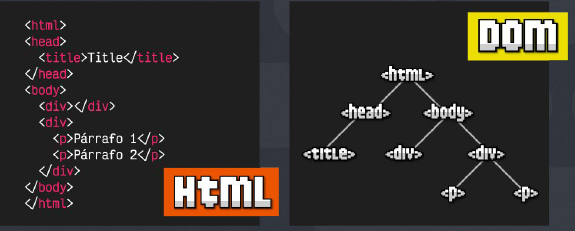

# Explorando el DOM para desarrollo
Si queremos examinar el DOM en nuestro navegador podemos hacerlo a través de las herramientas de desarrollo 
Click derecho > inspeccionar

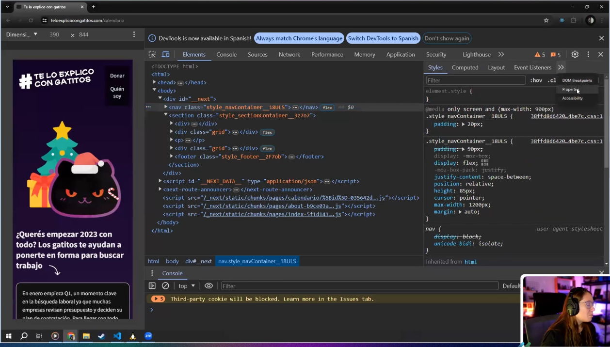

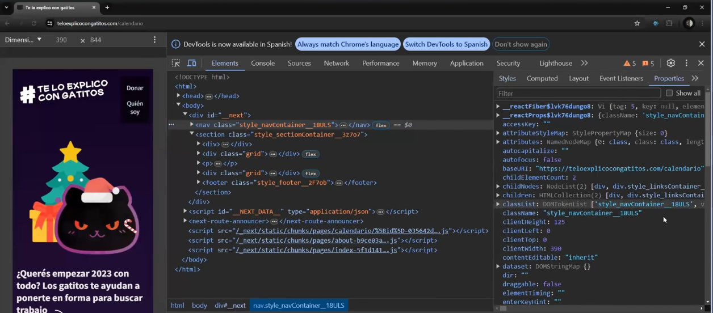

## Ya puedo explorar el DOM ¿Y ahora que?
Ahora que podemos ver y explorar el DOM es hora de empezar a modificarlo, para eso vamos a utilizar algunas herramientas de Javascript.

# Selección de elementos: Usando el método querySelector
El método querySelector de JavaScript permite `seleccionar el primer elemento` del DOM que coincide con un selector CSS específico. Es muy útil cuando queremos manipular un elemento específico y conocemos su clase, id o cualquier otro selector válido en CSS.

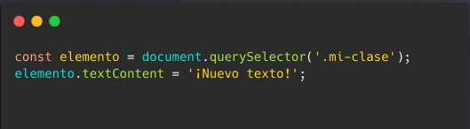

# Selección de elementos: Usando el método querySelectorAll
A diferencia de querySelector, querySelectorAll `devuelve una NodeList` (similar a un array pero no exactamente igual) que contiene todos los elementos que coinciden con el selector CSS proporcionado. Esto es útil cuando necesitamos trabajar con todos los elementos que comparten una clase, tag o atributo específico.

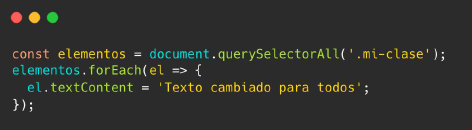

# Trabajando con eventos: addEventListener
El método addEventListener es utilizado en JavaScript para adjuntar un “manejador” de eventos (`una función que escucha a un elemento del DOM y “reacciona”`). Este método toma al menos dos argumentos: el nombre del evento a escuchar y la función a ejecutar cuando el evento ocurre.

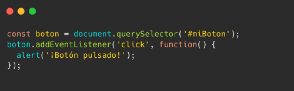

# Momento que soy lento ¿Que cuernos es un evento?
En JavaScript, un evento es cualquier acción significativa que pueda ser detectada. Estas acciones pueden ser realizadas por el usuario o el navegador e incluyen pero no se limitan a: Hacer click con el mouse, presionar una tecla, mover el mouse, cargar una página, darle
play o stop a un video, enviar un formulario, cambiar el tamaño de una ventana y más.
Al detectar estos eventos nosotros podemos dar interactividad a la página realizando acciones como respuesta.

https://developer.mozilla.org/en-US/docs/Web/Events

# Características de los eventos: Event bubbling
El "event bubbling" o propagación de eventos es un mecanismo por el cual un evento se propaga desde el elemento que lo originó (el elemento objetivo) hasta otros elementos ascendentes en el DOM.
Por ejemplo, si hacemos click en un elemento  que está dentro de un 
, el evento de clic se disparará primero en el  y luego se propagará al 
 y a otros contenedores ascendentes, a menos que se detenga explícitamente.

# Modificando contenido dinámicamente: innerHTML

El uso de innerHTML en JavaScript `permite obtener o modificar el contenido HTML de un elemento del DOM`. Al usar innerHTML, puedes leer el HTML actual dentro de un elemento o asignar nuevo contenido HTML a ese elemento.

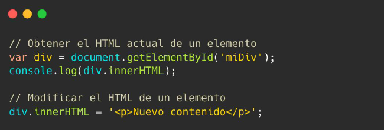

# Modificando contenido dinámicamente: createNode y appendNode

El método createElement crea un nuevo elemento que puedes configurar y luego agregar al DOM utilizando appendChild.

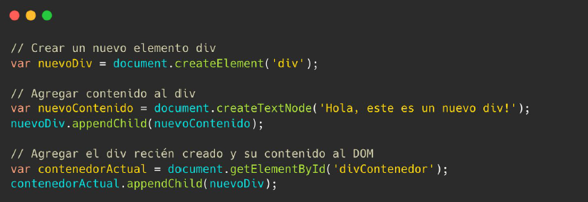

## Como frenamos esa propagacion?

Capturamos el event en la funcion y usamos stopPropagation()

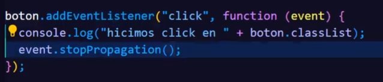

# Modificando contenido dinámicamente: agregando clases

Para agregar o modificar clases en elementos HTML usando JavaScript, puedes utilizar las propiedades y métodos del atributo classList. Este es un atributo de los elementos del DOM que proporciona métodos para añadir, eliminar, y toggle (alternar) clases CSS, además de
comprobar si cierta clase existe en el elemento.

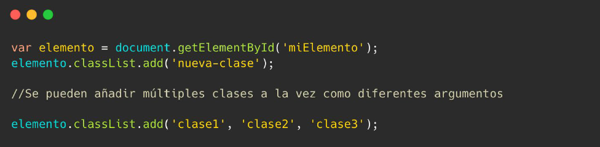

# Modificando contenido dinámicamente: cambiando estilos

Se puedes modificar los estilos CSS de elementos HTML directamente desde JavaScript utilizando la propiedad style del elemento. Esto nos permite cambiar dinámicamente la apariencia de un elemento sin modificar las hojas de estilo CSS.

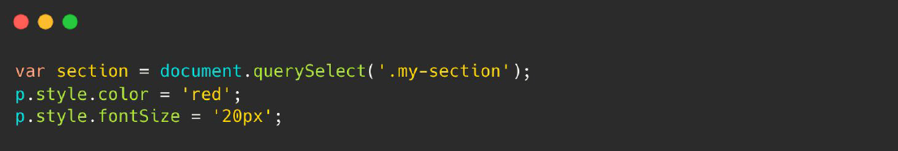

# Recursos:

## Eventos en Javascript
https://lenguajejs.com/javascript/dom/que-es/
https://codigofacilito.com/cursos/javascript-dom

## Código que vimos en clase:
https://github.com/doomling/cf-frontendg3

# Dudas y consultas:
https://doomling.dev/

# Tarea
Crear una app para crear editar y borrar tareas

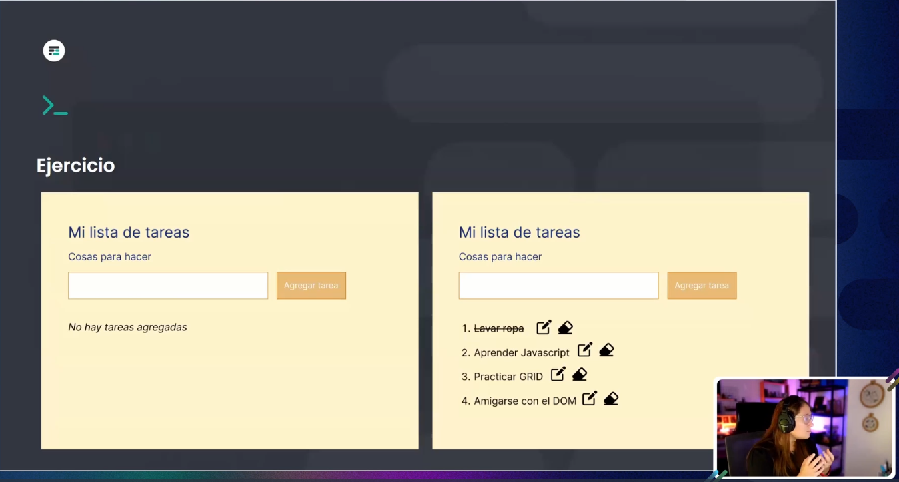