# Custom Properties

Las *custom properties* (propiedades personalizadas) en CSS, también conocidas como variables CSS, permiten definir valores reutilizables que puedes emplear en varias reglas de estilo.

## Definición 1

Una custom property es una variable definida por el usuario en CSS, cuyo nombre comienza con dos guiones (`--`). Se accede a su valor usando la función `var()`.

## Definición 2

Las "custom properties" (o "variables") son entidades que
guardan valores específicos. Estos valores pueden ser
usados de nuevo en un documento.
Se crean con la notación de "custom properties" y se usan
con la función "var()".

## Alcance (Scope)

El alcance de una custom property depende del selector donde se declara:

- **:root**: Si defines la variable en `:root`, estará disponible globalmente en todo el documento.
- **Selector específico**: Si la defines dentro de una clase, id o elemento, solo estará disponible para ese selector y sus descendientes.

### Ejemplo de alcance global

```css
:root {
    --font-size: 0.75rem;
}

.paragraph {
    font-size: var(--font-size);
}
```

### Ejemplo de alcance limitado

```css
.card {
    --card-bg: #f5f5f5;
    background: var(--card-bg);
}
```

### ¿A quién afecta?

Afecta a todos los elementos que estén dentro del alcance donde se declaró la variable. Si un elemento no tiene acceso a la variable (por alcance), no podrá usar su valor y puede heredar el valor de un ancestro o usar un valor por defecto si se especifica.

### Resumen

Las custom properties facilitan la gestión y reutilización de valores en CSS, mejorando la mantenibilidad y consistencia de los estilos. Su alcance depende de dónde se declaren y afectan a los elementos dentro de ese contexto.


## Ejemplo de redefinición de custom properties

Este ejemplo muestra cómo usar Custom Properties (variables CSS) para definir y reutilizar valores de estilos, facilitando la personalización y el mantenimiento del código.

```css
:root {
    --font-size: 1rem;
}

.paragraph {
    --font-size: 0.75rem;
    font-size: var(--font-size);
}
```

### Explicación paso a paso

1. `:root` define variables globales CSS. Aquí, `--font-size` se establece en `1rem` (tamaño base de fuente).
2. `.paragraph` redefine la variable `--font-size` solo dentro de los elementos con esa clase, cambiándola a `0.75rem`.
3. Dentro de `.paragraph`, `font-size: var(--font-size);` usa la variable local, aplicando el tamaño de fuente redefinido.

Esto permite que diferentes partes del sitio usen distintos valores para la misma variable, manteniendo el código limpio y flexible.

### ¿Por qué es útil?

Puedes cambiar el tamaño de fuente de `.paragraph` sin afectar el resto del sitio, y si cambias el valor en `:root`, todo el sitio se actualiza excepto donde se haya redefinido localmente.


## Ejemplo: Uso de variables CSS con valor de respaldo (fallback)

El siguiente código CSS define una variable personalizada `--font-size` para el selector `.paragraph`. Luego, utiliza esa variable para establecer el tamaño de fuente. Si por alguna razón `--font-size` no está definida, se usará el valor de respaldo `0.75rem` gracias al segundo parámetro de `var()`.

```css

.paragraph {
  --font-size: 0.75rem;
  font-size: var(--font-size, 0.75rem);
}

```

### ¿Por qué es útil?
Esto permite que el tamaño de fuente se pueda sobrescribir fácilmente en diferentes partes del sitio, y siempre habrá un valor predeterminado si la variable no está disponible.


---

# Responsive Web Design

**Responsive Design** es una técnica de diseño web que permite que las páginas se adapten y se vean correctamente en una amplia variedad de dispositivos y tamaños de pantalla, desde computadoras de escritorio hasta teléfonos móviles. Utiliza CSS y otras tecnologías para ajustar automáticamente la disposición, el tamaño y la apariencia de los elementos según el dispositivo del usuario.

Cuando se utiliza el término **responsive** (adaptable), nos
referimos principalmente a `responsive web design` (diseño
web adaptable). 
Esto significa hacer que un sitio web sea accesible y
adaptable en todos los dispositivos: tablets, smartphones...


## Ejemplo: Logos Responsivos

La página [responsivelogos.co.uk](https://responsivelogos.co.uk/) muestra cómo los logotipos de marcas pueden adaptarse de forma responsiva según el ancho de la pantalla. Para lograr esto, utiliza CSS y, en algunos casos, SVGs que cambian su apariencia o simplifican su diseño a medida que el espacio disponible se reduce.


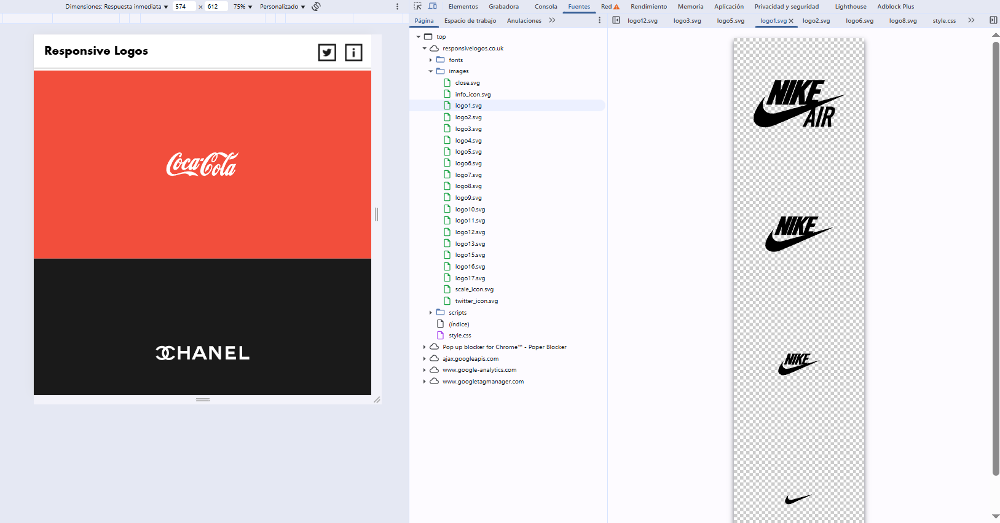

### Codigo original

```css

.logo1 {
  width: 300px;
  height: 300px;
  background: url(images/logo1.svg);
  background-position: center top;
  padding:0px;
}

.logo2 {
  width: 300px;
  height: 300px;
  background: url(images/logo2.svg);
  background-position: center top;
}

.logo3 {
  width: 300px;
  height: 300px;
  background: url(images/logo3.svg);
  background-position: center top;
}

.logo4 {
  width: 300px;
  height: 300px;
  background: url(images/logo4.svg);
  background-position: center top;
}

.logo5 {
  width: 300px;
  height: 300px;
  background: url(images/logo5.svg);
  background-position: center top;
}

.logo6 {
  width: 300px;
  height: 300px;
  background: url(images/logo6.svg);
  background-position: center top;
}


.logo7 {
  width: 300px;
  height: 300px;
  background: url(images/logo7.svg);
  background-position: -900px 0px;
}

.logo8 {
  width: 300px;
  height: 300px;
  background: url(images/logo8.svg);
  background-position: -900px 0px;
}

.logo9 {
  width: 300px;
  height: 300px;
  background: url(images/logo9.svg);
  background-position: -900px 0px;
}

.logo10 {
  width: 300px;
  height: 300px;
  background: url(images/logo10.svg);
  background-position: -900px 0px;
}

.logo11 {
  width: 300px;
  height: 300px;
  background: url(images/logo11.svg);
  background-position: -900px 0px;
}

.logo12 {
  width: 300px;
  height: 300px;
  background: url(images/logo12.svg);
  background-position: -900px 0px;
}

.logo13 {
  width: 300px;
  height: 300px;
  background: url(images/logo13.svg);
  background-position: -900px 0px;
}

.logo14 {
  width: 300px;
  height: 300px;
  background: url(images/logo14.svg);
  background-position: -900px 0px;
}

.logo15 {
  width: 300px;
  height: 300px;
  background: url(images/logo15.svg);
  background-position: -900px 0px;
}

.logo16 {
  width: 300px;
  height: 300px;
  background: url(images/logo16.svg);
  background-position: -900px 0px;
}

.logo17 {
  width: 300px;
  height: 300px;
  background: url(images/logo17.svg);
  background-position: -900px 0px;
}

@media only screen and (min-width: 15em) {
	.logo1, .logo2, .logo3, .logo4, .logo5, .logo6, .logo7, .logo8, .logo9, .logo10, .logo11, .logo12, .logo13, .logo14, .logo15, .logo16, .logo17 {background-position: left -900px;}
}

@media only screen and (min-width: 28em) {
	.logo1, .logo2, .logo3, .logo4, .logo5, .logo6, .logo7, .logo8, .logo9, .logo10, .logo11, .logo12, .logo13, .logo14, .logo15, .logo16, .logo17 {background-position: left -600px;}
}

@media only screen and (min-width: 45em){
	.logo1, .logo2, .logo3, .logo4, .logo5, .logo6, .logo7, .logo8, .logo9, .logo10, .logo11, .logo12, .logo13, .logo14, .logo15, .logo16, .logo17 {background-position: left -300px;}
}

@media only screen and (min-width: 60em){
	.logo1, .logo2, .logo3, .logo4, .logo5, .logo6, .logo7, .logo8, .logo9, .logo10, .logo11, .logo12, .logo13, .logo14, .logo15, .logo16, .logo17   {background-position: left 0px;}
 }

 ```


### ¿Cómo funciona el diseño responsivo de logos?

El diseño responsivo permite que los logos se adapten visualmente a diferentes tamaños de pantalla, asegurando que siempre se vean bien y sean legibles. Aquí te explico los conceptos clave y cómo se aplican en el código:

#### 1. **Media Queries**
Las *media queries* de CSS permiten aplicar estilos diferentes según el ancho de la pantalla. Así, puedes cambiar el tamaño, la posición o incluso mostrar/ocultar partes del logo dependiendo del dispositivo (móvil, tablet, escritorio).

#### 2. **SVGs Dinámicos**
Muchos logos se crean en formato SVG, lo que facilita modificar sus elementos internos (como colores, formas o textos) usando CSS. Esto permite que el logo sea flexible y se adapte a distintos contextos visuales.

#### 3. **Simplificación Progresiva**
Cuando el espacio disponible disminuye, el logo puede simplificarse: mostrar solo el símbolo, una versión abreviada o eliminar detalles para mantener la claridad y legibilidad.


### Ejemplo de código CSS

El siguiente código muestra cómo se aplican estos conceptos:

```css
.logo1, .logo2, .logo3, .logo4, .logo5, .logo6,
.logo7, .logo8, .logo9, .logo10, .logo11, .logo12,
.logo13, .logo14, .logo15, .logo16, .logo17 {
  width: 300px;
  height: 300px;
  background-position: center top;
  padding: 0px;
}

/* Cada logo usa una imagen SVG diferente */
.logo1 { background: url(images/logo1.svg); }
.logo2 { background: url(images/logo2.svg); }
/* ...continúa para cada logo... */
.logo17 { background: url(images/logo17.svg); }

/* Cambia la posición del fondo según el ancho de pantalla */
@media only screen and (min-width: 15em) {
  .logo1, .logo2, .logo3, .logo4, .logo5, .logo6,
  .logo7, .logo8, .logo9, .logo10, .logo11, .logo12,
  .logo13, .logo14, .logo15, .logo16, .logo17 {
    background-position: left -900px;
  }
}

@media only screen and (min-width: 28em) {
  .logo1, .logo2, .logo3, .logo4, .logo5, .logo6,
  .logo7, .logo8, .logo9, .logo10, .logo11, .logo12,
  .logo13, .logo14, .logo15, .logo16, .logo17 {
    background-position: left -600px;
  }
}

@media only screen and (min-width: 45em) {
  .logo1, .logo2, .logo3, .logo4, .logo5, .logo6,
  .logo7, .logo8, .logo9, .logo10, .logo11, .logo12,
  .logo13, .logo14, .logo15, .logo16, .logo17 {
    background-position: left -300px;
  }
}

@media only screen and (min-width: 60em) {
  .logo1, .logo2, .logo3, .logo4, .logo5, .logo6,
  .logo7, .logo8, .logo9, .logo10, .logo11, .logo12,
  .logo13, .logo14, .logo15, .logo16, .logo17 {
    background-position: left 0px;
  }
}
```


### Resumen

- **Media queries** ajustan el logo según el tamaño de pantalla.
- **SVGs** permiten modificar el logo fácilmente con CSS.
- **Simplificación progresiva** mantiene la legibilidad en espacios pequeños.
- El código CSS muestra cómo cambiar la posición del logo para adaptarse a diferentes dispositivos.

> **Consejo:** Puedes combinar estos métodos para lograr logos realmente flexibles y adaptables en cualquier proyecto web.


---

## Testing en el browser 

**Compatibilidad de características CSS en navegadores**

No todos los navegadores soportan de la misma manera las nuevas características de CSS, como las *custom properties* (variables CSS), media queries avanzadas, o ciertos valores y funciones modernas. Por eso, es importante consultar recursos como [Can I use](https://caniuse.com/) para verificar el soporte antes de usar una tecnología en producción.


### Ejemplo: Soporte de Custom Properties

Las *custom properties* (`--variable`) están soportadas en la mayoría de los navegadores modernos (Chrome, Firefox, Edge, Safari), pero no en versiones antiguas de Internet Explorer. Si necesitas compatibilidad con navegadores antiguos, deberás usar soluciones alternativas o proporcionar valores de respaldo (fallbacks) usando la función `var()`.

### Ejemplo: Media Queries

Las media queries básicas tienen soporte amplio, pero algunas funciones avanzadas (como `@media (hover: hover)` o `@media (pointer: fine)`) pueden no estar disponibles en todos los navegadores o dispositivos.

### ¿Cómo verificar compatibilidad?

- Visita [Can I use](https://caniuse.com/) y busca la característica que deseas usar.
- Consulta la tabla para ver en qué navegadores y versiones está soportada.
- Considera usar *fallbacks* o *polyfills* si necesitas compatibilidad amplia.

> **Consejo:** Siempre prueba tu sitio en diferentes navegadores y dispositivos para asegurar una experiencia consistente para todos los usuarios.


---

# Analíticas de usuario

`Enfocarse en crear la mejor experiencia en los dispositivos que mas accedan los usuarios`

Las **analíticas de usuario** en el desarrollo web consisten en recopilar y analizar datos sobre cómo los usuarios interactúan con un sitio o aplicación. Esta información permite identificar los dispositivos, navegadores y resoluciones de pantalla más utilizados, así como los comportamientos y preferencias de los visitantes. Gracias a estos datos, es posible optimizar la experiencia de usuario enfocándose en los dispositivos y plataformas más relevantes para la audiencia objetivo.

*Probar el inspector del navegador para distintos tamaños de dispositivos*

Otra web interesante es [Browser stack](https://www.browserstack.com/)
Para probar distintos tamaños de dispositivos


---


# Viewport 

`El viewport es el área de la página web que puedes ver en la pantalla. Su tamaño puede cambiar según el tamaño de la ventana del navegador y si estás en un móvil o desktop.`

El diseño web responsive se enfoca en hacer que el contenido se ajuste y se vea bien en diferentes dispositivos y tamaños de pantalla.


---

# Mobile First

`Mobile First es un enfoque de desarrollo y diseño web que se enfoca en la priorización del diseño y el desarrollo para dispositivos móviles por encima del diseño y desarrollo para pantallas de escritorio.`

El enfoque "Mobile-first" y sus ventajas:

- Diseño para pantallas pequeñas y mejora progresiva para pantallas más grandes.

- Estrategias para optimizar el rendimiento en dispositivos móviles.


En css seria trabajar los media queries con min-width: 

`NO USAR max-width: en Mobile first`


En HTML, es fundamental incluir la metaetiqueta 

<meta name="viewport" content="width=device-width, initial-scale=1" />

que asegura que el sitio se adapte correctamente al ancho del dispositivo y que la escala inicial sea adecuada para móviles.

La etiqueta <meta name="viewport" content="width=device-width, initial-scale=1" /> es fundamental en el desarrollo web responsivo. Su función principal es indicar al navegador que el ancho de la página debe coincidir con el ancho del dispositivo (por ejemplo, el ancho de la pantalla de un móvil o tablet). Además, establece la escala inicial en 1, lo que significa que la página no estará ni ampliada ni reducida al cargarse.

`Sin esta metaetiqueta, los navegadores móviles suelen mostrar las páginas web con un ancho fijo pensado para escritorio, lo que obliga al usuario a hacer zoom y desplazarse lateralmente. `

Al incluirla, se garantiza que el diseño y los estilos CSS responsivos funcionen correctamente, adaptando el contenido a cualquier tamaño de pantalla y mejorando la experiencia del usuario en dispositivos móviles.

---

# Atomic Design

**Atomic Design** es una metodología de diseño que organiza los elementos de una interfaz de usuario en diferentes niveles de complejidad:

- **Átomos:** Son los componentes más básicos, como botones, inputs o etiquetas.
- **Moléculas:** Combinaciones de átomos que forman una unidad funcional, por ejemplo, un campo de búsqueda compuesto por un input y un botón.
- **Organismos:** Grupos de moléculas y/o átomos que forman secciones más complejas de la interfaz, como un encabezado o un formulario.
- **Plantillas:** Estructuras que definen el layout general de una página, combinando organismos, moléculas y átomos.
- **Páginas:** Versiones finales que muestran el contenido real y permiten ver cómo se comporta la interfaz en situaciones reales.

> **Ventajas:**  
> - Permite crear interfaces de usuario más **consistentes**, **flexibles** y **escalables**.  
> - Facilita la reutilización de componentes y el mantenimiento del diseño a largo plazo.


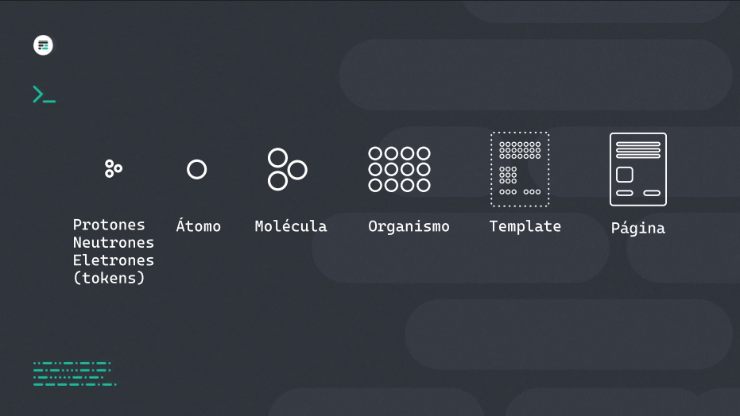

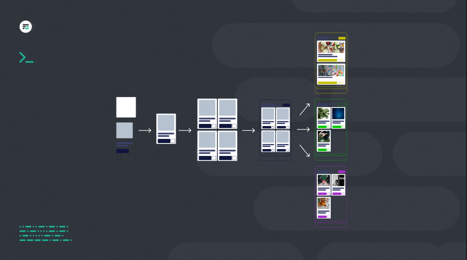


Un **Design System** es una forma en que el equipo de desarrollo de producto puede trabajar juntos y resolver problemas de manera colaborativa utilizando un lenguaje común.

El objetivo de crear un sistema de diseño es hacer un producto que sea fácil de escalar, consistente y fácil de utilizar.

Tener nuestro propio sistema de diseño nos ayuda a crear una interfaz de usuario que pueda crecer en el futuro.

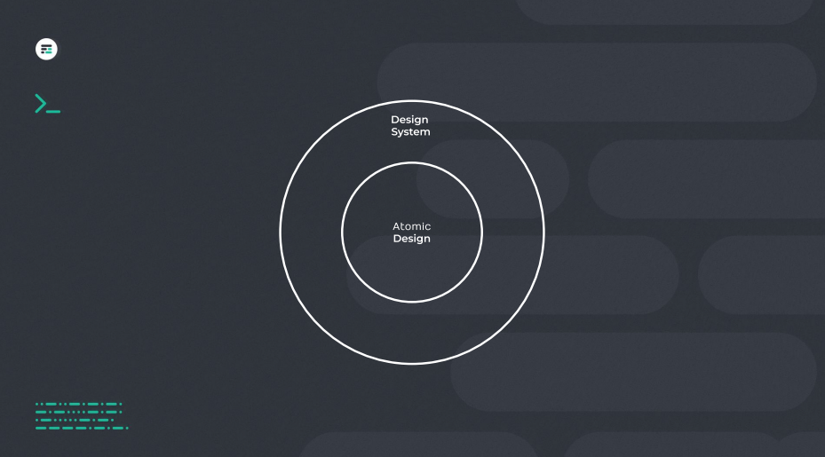

---

# Tecnicas responsivas

Visitar este Notion que tiene mucho sbre estas tecnicas

https://carmenansio.notion.site/C-digo-Facilito-RWD-16fda69b232c4a6795949d45a46c4e0c


# **Introducción RWD**

El diseño responsive sólo significa que tu sitio web es accesible con todos los tamaños de pantalla, desde las pantallas de escritorio hasta los dispositivos telefónicos más pequeños.

### Entendiendo los básicos

Es esencial comprender las grids fluidas (diseños flexibles), las imágenes flexibles (que se escalan sin proporciones extrañas) y las Media Queries (condicionales que aplican estilos en función del tamaño de la pantalla).


💡 Técnicas esenciales de CSS que son fundamentales para el diseño responsive.


## **1. Grids fluidas**

Concepto: La base del diseño responsive se encuentra en las grids fluidas. Estas grids se adaptan al tamaño de la pantalla, asegurando una experiencia consistente en todos los dispositivos.

Snippet:

```css
.container {
  width: 100%;
  max-width: 1200px;
  margin: 0 auto;
}
.row {
  display: flex;
  flex-wrap: wrap;
}
.column {
  flex: 1;
}
```


## **2. Imágenes Flexibles**

Utiliza srcset y elementos picture para mostrar las imágenes en el formato adecuado para cada dispositivo, a fin de garantizar que tu web se carga rápidamente.

Es como incluir una media querie en HTML. Que permite seleccionar la imagen dependiendo del tamaño de pantalla.

Snippet HTML:

```html

<picture>
   <source media="(min-width: 36em)"
      srcset="large.jpg  1024w,
         medium.jpg 640w,
         small.jpg  320w"
      sizes="33.3vw" />
   <source srcset="cropped-large.jpg 2x,
         cropped-small.jpg 1x" />
   
</picture>

```


#### Explicación completa sobre `<picture>` y `<source>`

El elemento `<picture>` permite mostrar imágenes adaptadas a diferentes dispositivos y resoluciones, optimizando la carga y visualización según el contexto del usuario.

##### ¿Cómo funciona el elemento `<source>` en `<picture>`?

El elemento `<source>` dentro de `<picture>` permite definir diferentes imágenes que se mostrarán según las características del dispositivo o el tamaño de pantalla, de forma similar a cómo funcionan las media queries en CSS.

- **media:** Especifica una condición (por ejemplo, el ancho mínimo de pantalla) usando una media query. Si se cumple, el navegador usará la imagen indicada en ese `<source>`.
- **srcset:** Permite definir varias versiones de una imagen para diferentes resoluciones o tamaños de pantalla. El navegador elige la más adecuada según el dispositivo.
- **sizes:** Indica el tamaño que ocupará la imagen en la pantalla, ayudando al navegador a elegir la mejor opción de `srcset`.

El navegador evalúa cada `<source>` en orden y selecciona la primera que cumpla la condición del atributo `media`. Si ninguna coincide, usará la imagen del `` como opción por defecto.

Esto optimiza la carga de imágenes, mostrando solo la versión necesaria y mejorando el rendimiento en dispositivos móviles y de escritorio.


#### Ejemplo de uso

```html
<picture>
   <source media="(min-width: 36em)"
      srcset="large.jpg  1024w,
         medium.jpg 640w,
         small.jpg  320w"
      sizes="33.3vw" />
   <source srcset="cropped-large.jpg 2x,
         cropped-small.jpg 1x" />
   
</picture>
```


### Explicación paso a paso de cómo se selecciona cada imagen

1. **Primer `<source>`**
   ```html
   <source media="(min-width: 36em)"
      srcset="large.jpg  1024w,
              medium.jpg 640w,
              small.jpg  320w"
      sizes="33.3vw" />
   ```
   - **media="(min-width: 36em)"**: Si la pantalla tiene al menos 36em de ancho (~576px), el navegador evalúa este `<source>`.
   - **srcset**: Define varias imágenes con diferentes anchos. El navegador elige la más adecuada según el tamaño real que ocupará la imagen en pantalla.
     - `large.jpg 1024w`: Para mostrar la imagen a 1024px de ancho.
     - `medium.jpg 640w`: Para 640px de ancho.
     - `small.jpg 320w`: Para 320px de ancho.
   - **sizes="33.3vw"**: Indica que la imagen ocupará aproximadamente un tercio del ancho de la ventana.

2. **Segundo `<source>`**
   ```html
   <source srcset="cropped-large.jpg 2x,
                   cropped-small.jpg 1x" />
   ```
   - No tiene condición `media`, así que se aplica si la anterior no se cumple.
   - **srcset**:
     - `cropped-large.jpg 2x`: Imagen para pantallas de alta resolución (retina o 2x).
     - `cropped-small.jpg 1x`: Imagen para pantallas estándar (1x).

3. **Imagen por defecto**
   ```html
   
   ```
   - Si ninguna de las condiciones anteriores se cumple, el navegador usará esta imagen por defecto.

---

### ¿Cómo selecciona el navegador la imagen?

- El navegador evalúa los `<source>` de arriba hacia abajo.
- Si la condición `media` del primer `<source>` se cumple, elige la mejor imagen de su `srcset` según el tamaño y resolución de pantalla.
- Si no se cumple, pasa al siguiente `<source>` y selecciona la imagen adecuada según la resolución (`1x` o `2x`).
- Si ninguno de los `<source>` es válido, usa la imagen del ``.

De esta forma, siempre se muestra la imagen más óptima para


### Object-fit

La propiedad object-fit permite que una etiqueta `img` actúe como contenedor de la imagen.

Snippet CSS:

```css

img {
	width: 100%;
	object-fit: cover;
	height: max(10rem, 30vh);
}

```

Necesitamos emparejarla con una dimensión de altura para obtener una orientación adicional sobre cómo queremos que se comporte el contenedor de la imagen.


💡 Establecer un `aspect-ratio` resulta en que se mantenga la proporción a medida que los elementos crecen o se reducen, mientras que al solo establecer `object-fit` y `height`, la proporción de la imagen estará constantemente adaptandose a medida que cambien las dimensiones del contenedor.


## **3. Media Queries**

Concepto: Las Media queries son la piedra angular del diseño responsive, permitiendo diferentes estilos para diferentes tamaños de pantalla.

Snippet CSS:

```css
@media screen and (max-width: 768px) {
  .column {
    flex-basis: 50%;
  }
}
@media screen and (max-width: 480px) {
  .column {
    flex-basis: 100%;
  }
}
```

## **4. Tipografía con REMs**

Concepto: El uso de REMs para la tipografía garantiza la escalabilidad y la legibilidad en todos los dispositivos.

`**Rem** se adapta en base a lo que definimos en el :root{} en cambio **em** se adapta en base al contenedor padre.`

`Rem si hacen zoom en el navegador, es mejor, ya que cambian el tamaño definido en el :root{} y todo lo que esta debajo en la jerarquia se adapta.`


Snippet CSS:

```css
html {
  font-size: 16px;
}
h1 {
  font-size: 2rem; /* 32px */
}
```

## **5. Unidades de Viewport para dimensiones**

Concepto: Las unidades de viewport (`vw` y `vh`) ofrecen un enfoque dinámico para dimensionar elementos en relación al `viewport`.

Snippet CSS:

```css
header {
  height: 10vh;
}
section {
  width: 80vw;
}
```

## **6. CSS Grid Layout**

Concepto: `CSS Grid` proporciona una forma más avanzada y flexible de crear diseños.

Snippet CSS:

```css
.grid-container {
  display: grid;
  grid-template-columns: repeat(auto-fill, minmax(250px, 1fr));
}
```

https://codepen.io/enxaneta/full/adLPwv/


### Ejemplo de grid sin `Media Query` y con `Flexbox`

Snippet HTML:

```html
<div class="grid-container">
    <div class="grid-item">1</div>
    <div class="grid-item">2</div>
    <div class="grid-item">3</div>
    <div class="grid-item">4</div>
    <div class="grid-item">5</div>
    <div class="grid-item">6</div>
    <div class="grid-item">7</div>
    <div class="grid-item">8</div>
    <div class="grid-item">9</div>
</div>
```

Snippet CSS:

```css
 		.grid-container {
        display: grid;
        grid-template-columns: repeat(auto-fill, minmax(200px, 1fr)); /* Responsive grid with minimum column width of 200px */
        grid-gap: 20px; /* Gap between grid items */
        padding: 20px;
    }
    .grid-item {
        display: flex;
        background-color: #f0f0f0;
        padding: 20px;
        text-align: center;
    }
```

## **7. Flexbox para alineamientos**

Concepto: **Flexbox** es un modelo de diseño que simplifica la alineación y distribución de espacio entre los elementos en un contenedor.

Snippet CSS:

```css

.flex-container {
  display: flex;
  justify-content: space-between;
}

```

https://codepen.io/enxaneta/full/adLPwv/

```html

<ul class="flex-container">
  <li class="flex-item">1</li>
  <li class="flex-item">2</li>
  <li class="flex-item">3</li>
  <li class="flex-item">4</li>
  <li class="flex-item">5</li>
  <li class="flex-item">6</li>
</ul>

```


```css

.flex-container {
  /* We first create a flex layout context */
  display: flex;
  
  /* Then we define the flow direction 
     and if we allow the items to wrap 
   * Remember this is the same as:
   * flex-direction: row;
   * flex-wrap: wrap;
   */
  flex-flow: row wrap;
  
  /* Then we define how is distributed the remaining space */
  justify-content: space-around;
  
  padding: 0;
  margin: 0;
  list-style: none;
}

.flex-item {
  background: tomato;
  padding: 5px;
  width: 200px;
  height: 150px;
  margin-top: 10px;
  line-height: 150px;
  color: white;
  font-weight: bold;
  font-size: 3em;
  text-align: center;
}

```

## **8. Ocultar elementos**

Concepto: Ocultar ciertos elementos en pantallas más pequeñas puede mejorar la usabilidad y el atractivo estético.

Snippet CSS:

```css

@media screen and (max-width: 600px) {
  .hide-on-mobile {
    display: none;
  }
}
```


## **9.Enfoque Mobile-First**

Concepto: Comenzar con diseños móviles y escalar para pantallas más grandes asegura un diseño optimizado para móviles.

Snippet CSS:
```css

/* Base styles for mobile */
.container {
  padding: 10px;
}

/* Larger devices */
@media screen and (min-width: 768px) {
  .container {
    padding: 20px;
  }
}
```


## **10. CSS Variables para consistencia**

Concepto: Las Custom Properties promueven la consistencia y facilidad de mantenimiento, especialmente para colores y espaciado.
Snippet CSS:

```css

:root {
  --primary-color: #007bff;
  --spacing-small: 8px;
}

.element {
  background-color: var(--primary-color);
  margin: var(--spacing-small);
}
```


## **11. Contenedores con Aspect Ratio**
    
Concepto: Mantener las proporciones para elementos como videos e imágenes es crucial para una apariencia consistente.

Snippet CSS:

```css

.aspect-ratio-box {
  position: relative;
  width: 100%;
  padding-top: 16 / 9; /* 16:9 Aspect Ratio */
}

.aspect-ratio-box-content {
  position: absolute;
  top: 0;
  left: 0;
  width: 100%;
  height: 100%;
}
```

https://codepen.io/carmenansio/pen/RwOeoad/6030289ecb85e6befa11f5aaa65e5987


## **12.  Effectos hover en dispositivos táctiles**

Concepto: Adaptar los efectos de desplazamiento para dispositivos táctiles mejora la experiencia del usuario.

Snippet CSS:

```css

@media (hover: hover) {
  .element:hover {
    background-color: lightblue;
  }
}

```

---

# Unidades en CSS
En CSS, usamos tamaños con frecuencia. Para hacerlo correctamente, necesitamos entender las unidades que se pueden usar en CSS, como px (píxeles) y % (porcentajes).

Es útil conocer estos tipos de unidades antes de usar propiedades que necesiten medidas, como width o height.

### Unidades absolutas
Las unidades absolutas son las más fáciles. Son siempre iguales a una medida física. La más famosa es el píxel, que es una medida sencilla para empezar a usar en CSS.


```css
  .container {
  width: 300px;
  height: 200px;
  background: cosmicred;
  }
```


### Unidades relativas a la fuente

```css
  .container {

  font-size: 1em;

  }
```

### Unidades relativas al Viewport

```css
  .container {
  width: 50vw;
  height: 50vh;
  background: cosmicred;
  }
```

### Unidades relativas al contenedor
Dentro de la regla @container, se pueden usar unidades especiales como cqw, cqh, cqi, cqb, cqmin o cqmax. Sirven para ajustar un tamaño en base al porcentaje del contenedor, si su tamaño exacto no se conoce.

Si usamos 50cqw, se establecerá un tamaño del 50% del ancho del contenedor.

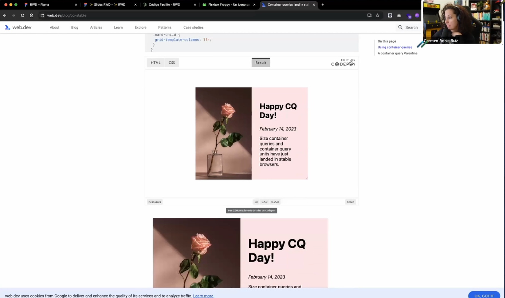

### Unidades relativas al Grid (fracción restante)

```css
  .grid {
  display: grid;
  grid-template-columns: 1fr 1fr;
  grid-template-rows: 2fr 1fr;
  }
```


`Existen varias funciones para hacer cálculos con unidades CSS. Son las funciones calc(), min(), max() o clamp()`


---

# Layout fluído

Concepto: La base del diseño responsive son las grids
fluidas. 

Estas cuadrículas se adaptan al tamaño de la pantalla,
garantizando una experiencia coherente en todos los
dispositivos

- Flexbox
- Grid Layout

https://wpshout.com/css-grid-tutorial-layout/#gref

```css

.container {

 width: 100%;

 max-width: 1200px;

 margin: 0 auto;

}

.row {

 display: flex;

 flex-wrap: wrap;

}

.column {

 flex: 1;

}
```

### Donde aprender flexbox y grid

- Tutorial con ejemplos de flexbox en CSStricks
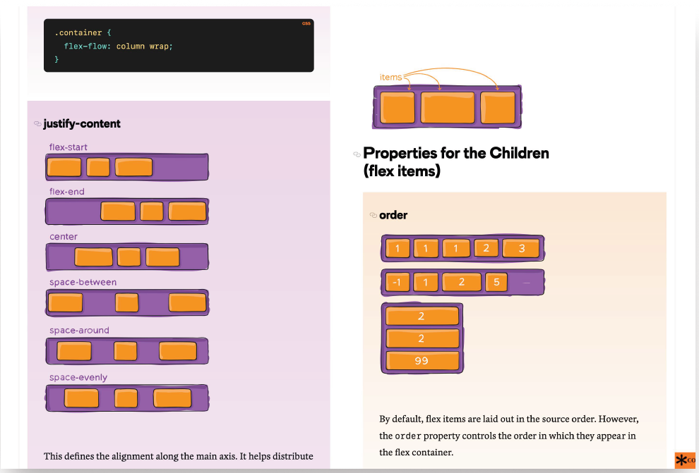

- Codepen de Gabi dinamico para flexbox
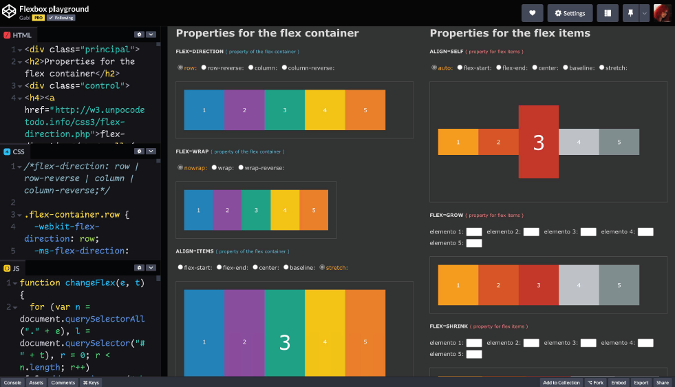

- Juego de la rana para aprender flexbox
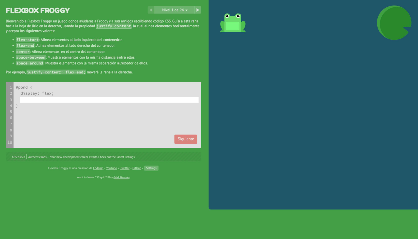

- Codepen de Carmen Ansio para template en flaxbox
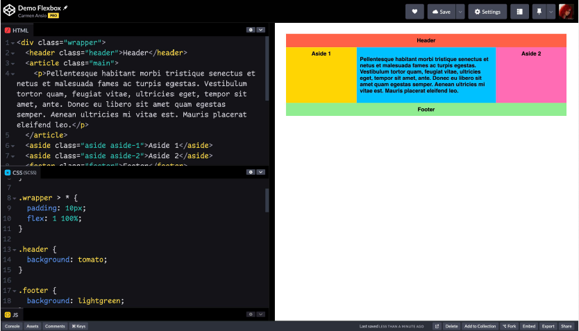


- Navbar responsive

```css

.auto-grid {
 --auto-grid-min-size: 16rem;
 display: grid;
 grid-template-columns: repeat(auto-fill, 

minmax(var(--auto-grid-min-size), 1fr));
 gap: 1rem;
}

https://codepen.io/carmenansio/pen/QWPYxGY/b3d885f2f7a27e0bf0c318ea55993232

```

- Web de Grid By Example, se puede ver y copiar el codigo de los templates


- Codepen de Carmen Ansio para Layouts con grid
  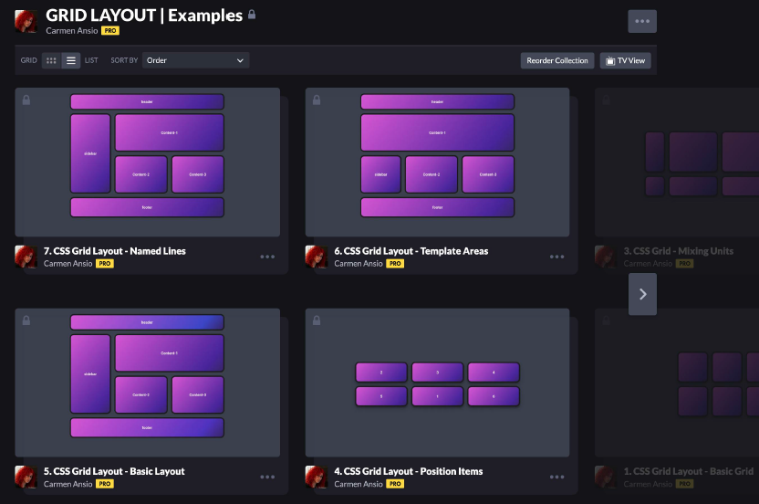

- Juego para regar plantas y aprender grid
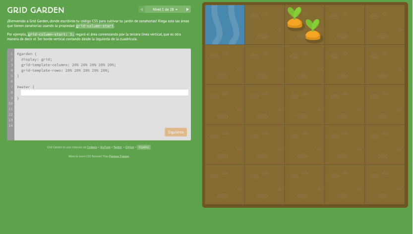

- Josh Comeau. Guia para aprender grid


- Web para generar Layouts 
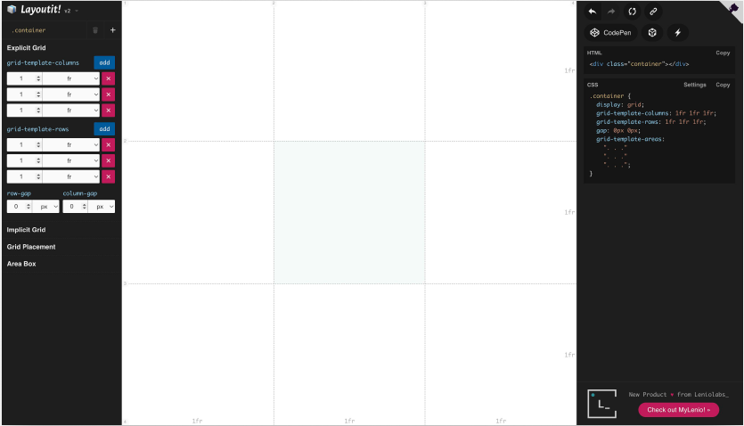


## Como quitar la interfaz de codepen?

`Buscar la opcion debug, para quitar todo lo que no me interesa y solo ver una web con el inspector`


## Como popiar los cambios que hago en el inspector y lo llevo a mi trabajo en visual studio?

Buscar Local overrides, que se guarda una hoja de estilos.

## Servicio de imagenes gratuito

https://unsplash.com/es

---

# Media Queries

Concepto: Las media queries son la piedra angular del diseño responsive, ya que permiten definir diferentes estilos para diferentes tamaños de pantalla.

La regla @media vincula un conjunto de declaraciones que se encuentran dentro de un bloque CSS con una condición establecida por un media query. 

Esta se puede usar tanto al inicio de la hoja de estilos como dentro de cualquier grupo de reglas condicionales.


```css

// Sintaxis antigua

@media screen and (width: 600px) and (width: 800px) { 

 ... 

}


// Sintaxis de rango

@media screen and (400px <= width <= 600px) {...}

```


---

# Container Queries

Concepto: Las container queries nos permiten ver el tamaño del contenedor y no solo la pantalla del dispositivo (viewport). 

Así podemos cambiar el estilo del contenido dependiendo del espacio del contenedor. Si el contenedor es pequeño, podríamos usar una fuente más pequeña, por ejemplo.


```css

container (min-width: 600px) { 

 .paragraph {

 font-size: 0.75rem;

 } 

}


// Sintaxis de rango

@container (400px <= width <= 600px) {...}

```

---

# Imágenes flexibles

Concepto: Las imágenes deben poder ajustarse dentro de los límites de las cuadrículas fluidas. Así se evita que las imágenes rompan el diseño en pantallas pequeñas.

```css

img {
 max-width: 100%;
 height: auto;
}

```


---

# Tipografía responsive

## Unidades em vs rem

Em vs. píxeles: Em es relativo al tamaño de la letra del elemento padre. Si usas 1.5em, el tamaño será 1.5 veces el del padre. Los píxeles son un tamaño fijo y no cambian con el tamaño de la letra.


Usa píxeles para un control exacto del tamaño y posición.
`Normalmente, se usan rem para el tamaño de texto, em para espaciado y píxeles para tamaños fijos como ancho y alto.`

https://codepen.io/enxaneta/pen/adLPwv


## Función clamp()

La función clamp() en CSS es una herramienta que `permite definir un valor que se mantiene dentro de un rango específico, estableciendo un mínimo, un preferido y un máximo`. Su sintaxis es clamp(valor-mínimo, valor-preferido, valor-máximo). Esto resulta especialmente útil en diseño responsivo, ya que permite que propiedades como el tamaño de fuente, el ancho o el margen se adapten dinámicamente al tamaño de la pantalla, pero sin salirse de los límites definidos.

Por ejemplo, al usar font-size: clamp(1rem, 2vw, 2rem);, el tamaño de la fuente crecerá o disminuirá según el ancho de la ventana, pero nunca será menor a 1rem ni mayor a 2rem. Así, se logra un diseño más flexible y controlado, evitando valores extremos que puedan afectar la legibilidad o la estética del sitio.


## Medida nueva ch, viene de character.

Ej: 
max-widht:30ch;


---

## Pseudoelementos `:first-child`, `::first-letter` y `::first-line` en CSS

### :first-child
El selector `:first-child` selecciona el primer hijo de su elemento padre. Por ejemplo, si tienes una lista y quieres aplicar un estilo especial solo al primer elemento `<li>`, puedes usar:

```css
li:first-child {
  color: red;
}
```

Esto hará que solo el primer <li> de cada lista se muestre en rojo.


### ::first-letter
El pseudoelemento ::first-letter selecciona la primera letra del texto dentro de un elemento. Es útil para crear efectos como letras capitulares (drop caps) en los párrafos:

```css

p::first-letter {
  font-size: 2em;
  font-weight: bold;
  color: #007bff;
}

```
Esto hará que la primera letra de cada párrafo sea más grande, en negrita y azul.

### ::first-line
El pseudoelemento ::first-line selecciona la primera línea visible de texto dentro de un elemento, según cómo se muestre en pantalla (puede variar si cambias el ancho del contenedor):

```css

p::first-line {
  font-variant: small-caps;
  color: #555;
}
```

Resumen:

:first-child selecciona el primer hijo de un padre.
::first-letter selecciona solo la primera letra del texto de un elemento.
::first-line selecciona solo la primera línea visible del texto de un elemento.
Estos pseudoelementos son útiles para mejorar la presentación y la legibilidad del contenido en tu sitio web.


### Ejemplo: 

Supongamos que tienes un artículo con varios párrafos y quieres que solo la primera letra del primer párrafo tenga un estilo especial (por ejemplo, una letra capitular):

```css
.article-body > p:first-child::first-letter {
  font-size: 3em;
  color: #e63946;
  float: left;
  line-height: 1;
  padding-right: 0.1em;
}
```

En este ejemplo:
- `.article-body > p:first-child` selecciona solo el primer `<p>` que es hijo directo de `.article-body`.
- `::first-letter` aplica el estilo únicamente a la primera letra de ese párrafo.
- El resultado es una letra inicial grande y destacada, típica de los libros o revistas.

```html
<div class="article-body">
  <p>Érase una vez un sitio web responsive...</p>
  <p>Este segundo párrafo no tendrá la letra capitular.</p>
</div>
```

---

# Variable Fonts

## Diferencia entre Variable Fonts y fuentes tradicionales

Las **Variable Fonts** (fuentes variables) son una evolución de las fuentes tipográficas tradicionales. Mientras que una fuente tradicional requiere un archivo diferente para cada variante (por ejemplo, regular, bold, italic), una variable font contiene todas las variantes en un solo archivo gracias a los "ejes" de variación.

### Características principales de las Variable Fonts:

- **Un solo archivo, múltiples estilos:** Puedes ajustar peso, ancho, inclinación y otros atributos tipográficos desde CSS, sin cargar varios archivos de fuente.
- **Transiciones suaves:** Permiten animar y ajustar valores intermedios (por ejemplo, `font-weight: 437`) y no solo los valores predefinidos.
- **Menor peso de descarga:** Al usar un solo archivo para todas las variantes, se reduce la cantidad de archivos que el navegador debe descargar.
- **Más control desde CSS:** Puedes usar propiedades como `font-variation-settings` o los nuevos ejes estándar (`font-weight`, `font-stretch`, `font-style`) para personalizar la tipografía de forma precisa y dinámica.

### Variable Fonts en Chrome y navegadores modernos

Chrome y otros navegadores modernos soportan completamente las variable fonts, permitiendo aprovechar todos sus ejes de variación y animaciones. Esto significa que puedes crear diseños más flexibles, accesibles y rápidos, adaptando la tipografía a diferentes dispositivos, resoluciones y preferencias de usuario.

**Ejemplo de uso en CSS:**
```css
h1 {
  font-family: 'InterVariable', sans-serif;
  font-weight: 300;
  font-stretch: 120%;
  font-variation-settings: "wght" 300, "wdth" 120;
}
```

### Resumen:
Las variable fonts permiten mayor flexibilidad, mejor rendimiento y más control visual respecto a las fuentes tradicionales, y su soporte en Chrome y otros navegadores modernos las hace ideales para proyectos web actuales.


## Se importan de igual manera?

Sí, las **Variable Fonts** se importan de la misma manera que las fuentes tradicionales, usando `@font-face` en CSS o mediante servicios como Google Fonts. La diferencia principal es que, al importar una variable font, solo necesitas un archivo para todas las variantes (peso, ancho, etc.), en lugar de varios archivos para cada estilo.

### Ejemplo de importación con `@font-face`:

```css
@font-face {
  font-family: 'InterVariable';
  src: url('InterVariable.woff2') format('woff2');
  font-weight: 100 900; /* Rango de pesos soportados */
  font-stretch: 75% 125%; /* Rango de anchos soportados */
  font-display: swap;
}
```

Luego puedes usar la fuente y sus variaciones en tu CSS:

```css

h1 {
  font-family: 'InterVariable', sans-serif;
  font-weight: 700;
  font-stretch: 110%;
}

```

### Ejemplo con Google Fonts:
Google Fonts ya soporta variable fonts. Puedes importar así:

```html

<link href="https://fonts.googleapis.com/css2?family=Roboto+Flex:opsz,wght@8..144,100..1000&display=swap" rel="stylesheet">

```
Y luego usar los ejes variables en tu CSS:

```css


body {
  font-family: 'Roboto Flex', sans-serif;
  font-variation-settings: "wght" 400, "opsz" 14;
}

```

Resumen:
La forma de importar variable fonts es igual que con fuentes tradicionales, pero aprovechas todas las variantes desde un solo archivo.


### API de audio 

Para poder jugar con las fuentes que son variable fonts, se puede modificar con el microfono o con algun teclado midi por ejemplo.

---


# Herramientas

Esta web CSS Stats realiza un analisis exaustivo de la web que le pasemos.

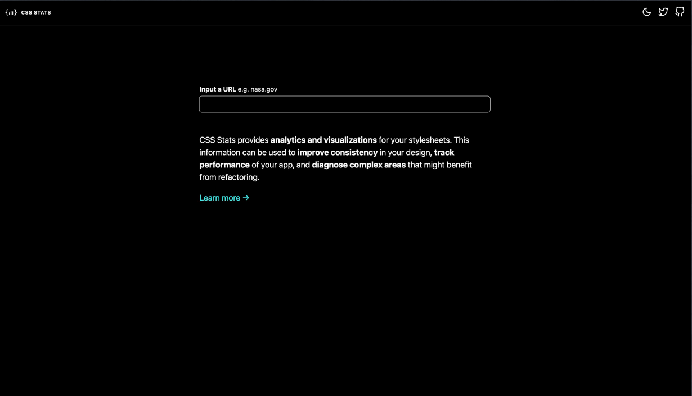